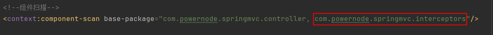
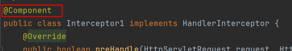
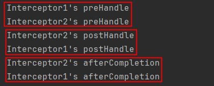
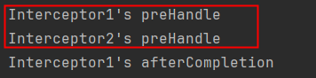

# 拦截器概述
**拦截器（Interceptor）类似于过滤器（Filter）**
Spring MVC的拦截器作用是在请求到达控制器之前或之后进行拦截，可以对请求和响应进行一些特定的处理。
拦截器可以用于很多场景下：

1.  登录验证：对于需要登录才能访问的网址，使用拦截器可以判断用户是否已登录，如果未登录则跳转到登录页面。 
2.  权限校验：根据用户权限对部分网址进行访问控制，拒绝未经授权的用户访问。 
3.  请求日志：记录请求信息，例如请求地址、请求参数、请求时间等，用于排查问题和性能优化。 
4.  更改响应：可以对响应的内容进行修改，例如添加头信息、调整响应内容格式等。 

拦截器和过滤器的区别在于它们的作用层面不同。

- 过滤器更注重在请求和响应的流程中进行处理，可以修改请求和响应的内容，例如设置编码和字符集、请求头、状态码等。
- 拦截器则更加侧重于对控制器进行前置或后置处理，在请求到达控制器之前或之后进行特定的操作，例如打印日志、权限验证等。

**Filter、Servlet、Interceptor、Controller的执行顺序：**


# 拦截器的创建与基本配置
## 定义拦截器
实现`org.springframework.web.servlet.HandlerInterceptor` 接口，共有三个方法可以进行选择性的实现：

- preHandle：处理器方法调用之前执行
   - **只有该方法有返回值，返回值是布尔类型，true放行，false拦截。**
- postHandle：处理器方法调用之后执行
- afterCompletion：渲染完成后执行


## 拦截器基本配置
在springmvc.xml文件中进行如下配置：
第一种方式：
```xml
<mvc:interceptors>
    <bean class="com.powernode.springmvc.interceptors.Interceptor1"/>
</mvc:interceptors>
```

第二种方式：
```xml
<mvc:interceptors>
    <ref bean="interceptor1"/>
</mvc:interceptors>
```
第二种方式的前提：

- 前提1：包扫描



- 前提2：使用 @Component 注解进行标注



**注意：对于这种基本配置来说，拦截器是拦截所有请求的。**


## 拦截器部分源码分析
### 方法执行顺序的源码分析
```java
public class DispatcherServlet extends FrameworkServlet {
    protected void doDispatch(HttpServletRequest request, HttpServletResponse response) throws Exception {
        // 调用所有拦截器的 preHandle 方法
        if (!mappedHandler.applyPreHandle(processedRequest, response)) {
            return;
        }
        // 调用处理器方法
        mv = ha.handle(processedRequest, response, mappedHandler.getHandler());
        // 调用所有拦截器的 postHandle 方法
        mappedHandler.applyPostHandle(processedRequest, response, mv);
        // 处理视图
        processDispatchResult(processedRequest, response, mappedHandler, mv, dispatchException);
    }

    private void processDispatchResult(HttpServletRequest request, HttpServletResponse response,
			@Nullable HandlerExecutionChain mappedHandler, @Nullable ModelAndView mv,
			@Nullable Exception exception) throws Exception {
        // 渲染页面
        render(mv, request, response);
        // 调用所有拦截器的 afterCompletion 方法
        mappedHandler.triggerAfterCompletion(request, response, null);
    }
}
```


### 拦截与放行的源码分析
```java
public class DispatcherServlet extends FrameworkServlet {
    protected void doDispatch(HttpServletRequest request, HttpServletResponse response) throws Exception {
        // 调用所有拦截器的 preHandle 方法
        if (!mappedHandler.applyPreHandle(processedRequest, response)) {
            // 如果 mappedHandler.applyPreHandle(processedRequest, response) 返回false，以下的return语句就会执行
            return;
        }
    }
}
```
```java
public class HandlerExecutionChain {
    boolean applyPreHandle(HttpServletRequest request, HttpServletResponse response) throws Exception {
		for (int i = 0; i < this.interceptorList.size(); i++) {
			HandlerInterceptor interceptor = this.interceptorList.get(i);
			if (!interceptor.preHandle(request, response, this.handler)) {
				triggerAfterCompletion(request, response, null);
                // 如果 interceptor.preHandle(request, response, this.handler) 返回 false，以下的 return false;就会执行。
				return false;
			}
			this.interceptorIndex = i;
		}
		return true;
	}
}
```


# 拦截器的高级配置
采用以上基本配置方式，拦截器是拦截所有请求路径的。如果要针对某些路径进行拦截，某些路径不拦截，可以采用高级配置：
```xml
<mvc:interceptors>
    <mvc:interceptor>
        <!--拦截所有路径-->
        <mvc:mapping path="/**"/>
        <!--除 /test 路径之外-->
        <mvc:exclude-mapping path="/test"/>
        <!--拦截器-->
        <ref bean="interceptor1"/>
    </mvc:interceptor>
</mvc:interceptors>
```
以上的配置表示，除 /test 请求路径之外，剩下的路径全部拦截。


# 拦截器的执行顺序
## 执行顺序
### 如果所有拦截器preHandle都返回true
按照springmvc.xml文件中配置的顺序，自上而下调用 preHandle：
```xml
<mvc:interceptors>
    <ref bean="interceptor1"/>
    <ref bean="interceptor2"/>
</mvc:interceptors>
```
执行顺序：



### 如果其中一个拦截器preHandle返回false
```xml
<mvc:interceptors>
    <ref bean="interceptor1"/>
    <ref bean="interceptor2"/>
</mvc:interceptors>
```
如果`interceptor2`的preHandle返回false，执行顺序：

规则：只要有一个拦截器`preHandle`返回false，任何`postHandle`都不执行。但返回false的拦截器的前面的拦截器按照逆序执行`afterCompletion`。


## 源码分析
DispatcherServlet和 HandlerExecutionChain的部分源码：
```java
public class DispatcherServlet extends FrameworkServlet {
    protected void doDispatch(HttpServletRequest request, HttpServletResponse response) throws Exception {
        // 按照顺序执行所有拦截器的preHandle方法
        if (!mappedHandler.applyPreHandle(processedRequest, response)) {
            return;
        }
        // 执行处理器方法
        mv = ha.handle(processedRequest, response, mappedHandler.getHandler());
        // 按照逆序执行所有拦截器的 postHanle 方法
        mappedHandler.applyPostHandle(processedRequest, response, mv);
        // 处理视图
        processDispatchResult(processedRequest, response, mappedHandler, mv, dispatchException);
    }

    private void processDispatchResult(HttpServletRequest request, HttpServletResponse response,
			@Nullable HandlerExecutionChain mappedHandler, @Nullable ModelAndView mv,
			@Nullable Exception exception) throws Exception {
        // 渲染视图
        render(mv, request, response);
        // 按照逆序执行所有拦截器的 afterCompletion 方法
        mappedHandler.triggerAfterCompletion(request, response, null);
    }
}
```
```java
public class HandlerExecutionChain {
    // 顺序执行 preHandle
    boolean applyPreHandle(HttpServletRequest request, HttpServletResponse response) throws Exception {
        for (int i = 0; i < this.interceptorList.size(); i++) {
            HandlerInterceptor interceptor = this.interceptorList.get(i);
            if (!interceptor.preHandle(request, response, this.handler)) {
                // 如果其中一个拦截器preHandle返回false
                // 将该拦截器前面的拦截器按照逆序执行所有的afterCompletion
                triggerAfterCompletion(request, response, null);
                return false;
            }
            this.interceptorIndex = i;
        }
        return true;
	}
    // 逆序执行 postHanle
    void applyPostHandle(HttpServletRequest request, HttpServletResponse response, @Nullable ModelAndView mv) throws Exception {
        for (int i = this.interceptorList.size() - 1; i >= 0; i--) {
            HandlerInterceptor interceptor = this.interceptorList.get(i);
            interceptor.postHandle(request, response, this.handler, mv);
        }
	}
    // 逆序执行 afterCompletion
	void triggerAfterCompletion(HttpServletRequest request, HttpServletResponse response, @Nullable Exception ex) {
		for (int i = this.interceptorIndex; i >= 0; i--) {
			HandlerInterceptor interceptor = this.interceptorList.get(i);
			try {
				interceptor.afterCompletion(request, response, this.handler, ex);
			}
			catch (Throwable ex2) {
				logger.error("HandlerInterceptor.afterCompletion threw exception", ex2);
			}
		}
	}
}
```


