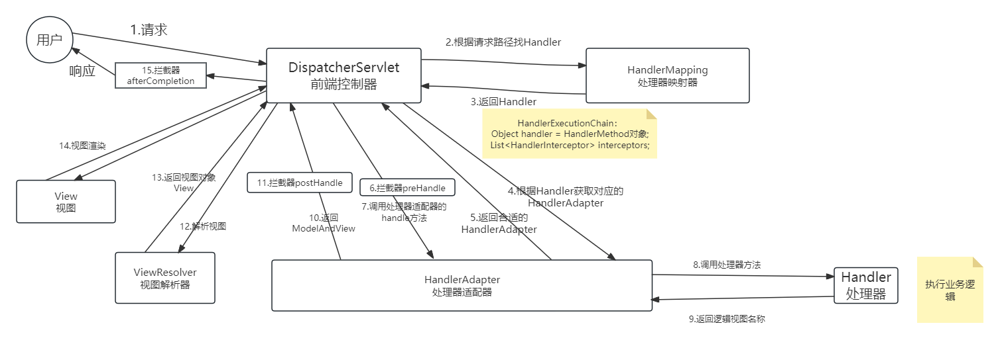
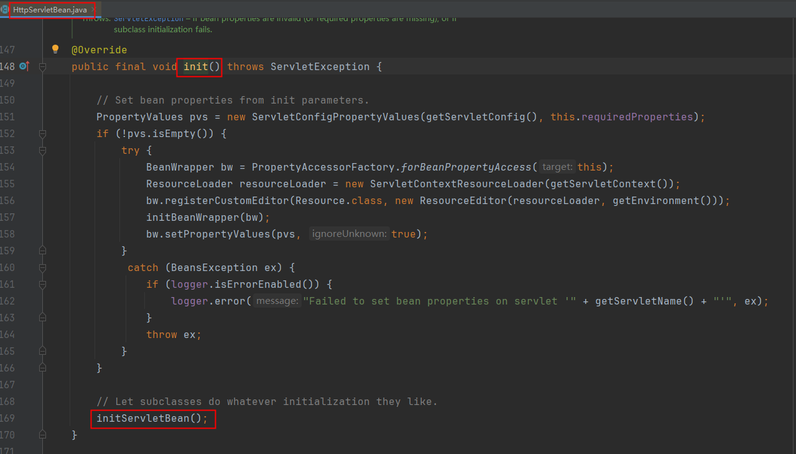

# 从源码角度看执行流程
以下是核心代码：
```java
public class DispatcherServlet extends FrameworkServlet {
    protected void doDispatch(HttpServletRequest request, HttpServletResponse response) throws Exception {
        // 根据请求对象request获取
        // 这个对象是在每次发送请求时都创建一个，是请求级别的
        // 该对象中描述了本次请求应该执行的拦截器是哪些，顺序是怎样的，要执行的处理器是哪个
        HandlerExecutionChain mappedHandler = getHandler(processedRequest);

        // 根据处理器获取处理器适配器。（底层使用了适配器模式）
        // HandlerAdapter在web服务器启动的时候就创建好了。（启动时创建多个HandlerAdapter放在List集合中）
        // HandlerAdapter有多种类型：
        // RequestMappingHandlerAdapter：用于适配使用注解 @RequestMapping 标记的控制器方法
        // SimpleControllerHandlerAdapter：用于适配实现了 Controller 接口的控制器
        // 注意：此时还没有进行数据绑定（也就是说，表单提交的数据，此时还没有转换为pojo对象。）
        HandlerAdapter ha = getHandlerAdapter(mappedHandler.getHandler());

        // 执行请求对应的所有拦截器中的 preHandle 方法
        if (!mappedHandler.applyPreHandle(processedRequest, response)) {
            return;
        }

        // 通过处理器适配器调用处理器方法
        // 在调用处理器方法之前会进行数据绑定，将表单提交的数据绑定到处理器方法上。（底层是通过WebDataBinder完成的）
        // 在数据绑定的过程中会使用到消息转换器：HttpMessageConverter
        // 结束后返回ModelAndView对象
        mv = ha.handle(processedRequest, response, mappedHandler.getHandler());

        //  执行请求对应的所有拦截器中的 postHandle 方法
        mappedHandler.applyPostHandle(processedRequest, response, mv);

        // 处理分发结果（在这个方法中完成了响应）
        processDispatchResult(processedRequest, response, mappedHandler, mv, dispatchException);
    }

    // 根据每一次的请求对象来获取处理器执行链对象
    protected HandlerExecutionChain getHandler(HttpServletRequest request) throws Exception {
		if (this.handlerMappings != null) {
            // HandlerMapping在服务器启动的时候就创建好了，放到了List集合中。HandlerMapping也有多种类型
            // RequestMappingHandlerMapping：将 URL 映射到使用注解 @RequestMapping 标记的控制器方法的处理器。
            // SimpleUrlHandlerMapping：将 URL 映射到处理器中指定的 URL 或 URL 模式的处理器。
			for (HandlerMapping mapping : this.handlerMappings) {
                // 重点：这是一次请求的开始，实际上是通过处理器映射器来获取的处理器执行链对象
                // 底层实际上会通过 HandlerMapping 对象获取 HandlerMethod对象，将HandlerMethod 对象传递给 HandlerExecutionChain对象。
                // 注意：HandlerMapping对象和HandlerMethod对象都是在服务器启动阶段创建的。
                // RequestMappingHandlerMapping对象中有多个HandlerMethod对象。
				HandlerExecutionChain handler = mapping.getHandler(request);
				if (handler != null) {
					return handler;
				}
			}
		}
		return null;
	}

    private void processDispatchResult(HttpServletRequest request, HttpServletResponse response,
			@Nullable HandlerExecutionChain mappedHandler, @Nullable ModelAndView mv,
			@Nullable Exception exception) throws Exception {
        // 渲染
        render(mv, request, response);
        // 渲染完毕后，调用该请求对应的所有拦截器的 afterCompletion方法。
        mappedHandler.triggerAfterCompletion(request, response, null);
    }

    protected void render(ModelAndView mv, HttpServletRequest request, HttpServletResponse response) throws Exception {
        // 通过视图解析器返回视图对象
        view = resolveViewName(viewName, mv.getModelInternal(), locale, request);
        // 真正的渲染视图
        view.render(mv.getModelInternal(), request, response);
    }

    protected View resolveViewName(String viewName, @Nullable Map<String, Object> model,
			Locale locale, HttpServletRequest request) throws Exception {
        // 通过视图解析器返回视图对象
        View view = viewResolver.resolveViewName(viewName, locale);
	}
}
```
```java
public interface ViewResolver {
    View resolveViewName(String viewName, Locale locale) throws Exception;
}
```
```java
public interface View {
    void render(@Nullable Map<String, ?> model, HttpServletRequest request, HttpServletResponse response)
			throws Exception;
}
```


# 从图片角度看执行流程



# WEB服务器启动时都做了什么

先搞明白核心类的继承关系：
DispatcherServlet extends FrameworkServlet extends HttpServletBean extends HttpServlet extends GenericServlet implements Servlet

服务器启动阶段完成了：

1. 初始化Spring上下文，也就是创建所有的bean，让IoC容器将其管理起来。
2. 初始化SpringMVC相关的对象：处理器映射器，处理器适配器等。。。





