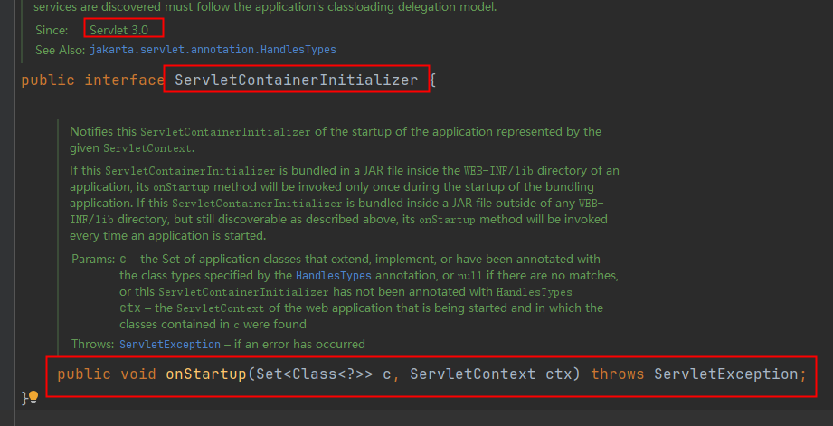
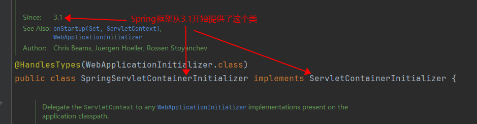
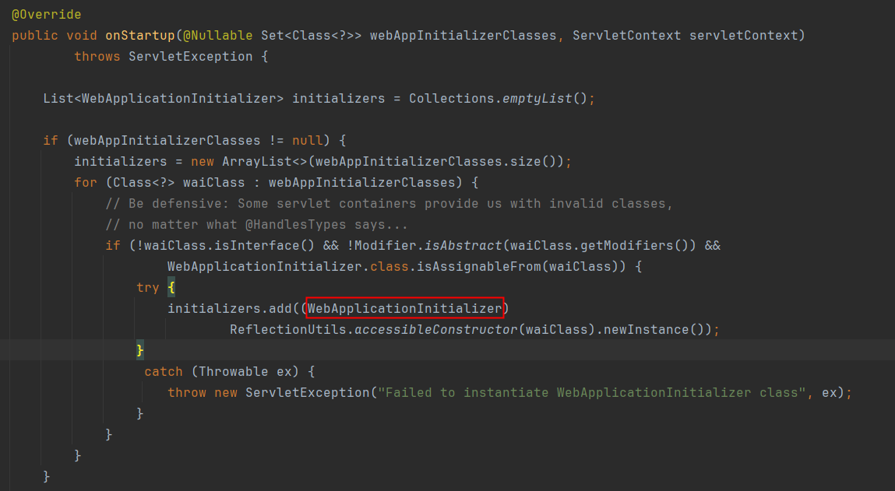
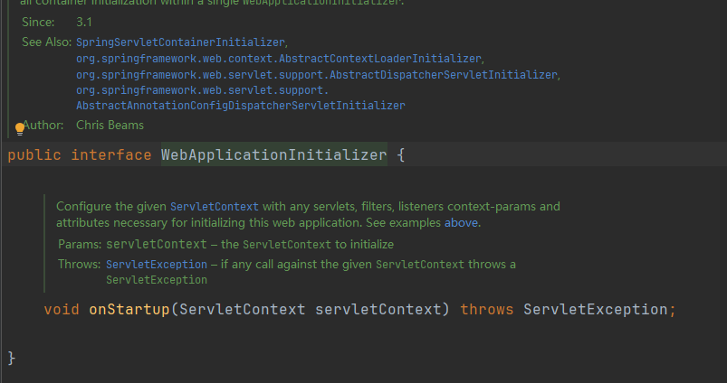
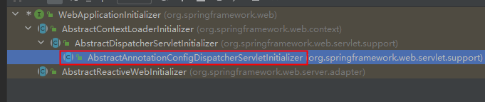
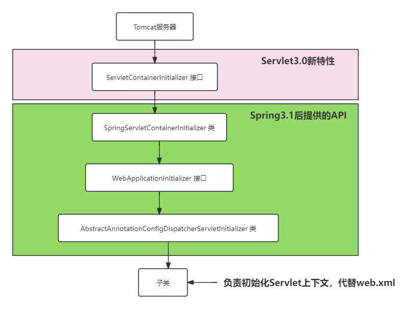

# web.xml文件的替代
## Servlet3.0新特性
Servlet3.0新特性：web.xml文件可以不写了。
在Servlet3.0的时候，规范中提供了一个接口：

服务器在启动的时候会自动从容器中找 `ServletContainerInitializer`接口的实现类，自动调用它的`onStartup`方法来完成Servlet上下文的初始化。


在Spring3.1版本的时候，提供了这样一个类，实现以上的接口：

它的核心方法如下：

可以看到在服务器启动的时候，它会去加载所有实现`WebApplicationInitializer`接口的类：

这个接口下有一个子类是我们需要的：`AbstractAnnotationConfigDispatcherServletInitializer`



当我们编写类继承`AbstractAnnotationConfigDispatcherServletInitializer`之后，web服务器在启动的时候会根据它来初始化Servlet上下文。




## 编写WebAppInitializer
以下这个类就是用来代替web.xml文件的：
```java
package com.powernode.springmvc.config;

import jakarta.servlet.Filter;
import org.springframework.web.filter.CharacterEncodingFilter;
import org.springframework.web.filter.HiddenHttpMethodFilter;
import org.springframework.web.servlet.support.AbstractAnnotationConfigDispatcherServletInitializer;

/**
 * ClassName: WebAppInitializer
 * Description:
 * Datetime: 2024/3/29 16:50
 * Author: 老杜@动力节点
 * Version: 1.0
 */
public class WebAppInitializer extends AbstractAnnotationConfigDispatcherServletInitializer {
    /**
     * Spring的配置
     * @return
     */
    @Override
    protected Class<?>[] getRootConfigClasses() {
        return new Class[]{SpringConfig.class};
    }

    /**
     * SpringMVC的配置
     * @return
     */
    @Override
    protected Class<?>[] getServletConfigClasses() {
        return new Class[]{SpringMVCConfig.class};
    }

    /**
     * 用于配置 DispatcherServlet 的映射路径
     * @return
     */
    @Override
    protected String[] getServletMappings() {
        return new String[]{"/"};
    }

    /**
     * 配置过滤器
     * @return
     */
    @Override
    protected Filter[] getServletFilters() {
        CharacterEncodingFilter characterEncodingFilter = new CharacterEncodingFilter();
        characterEncodingFilter.setEncoding("UTF-8");
        characterEncodingFilter.setForceRequestEncoding(true);
        characterEncodingFilter.setForceResponseEncoding(true);
        HiddenHttpMethodFilter hiddenHttpMethodFilter = new HiddenHttpMethodFilter();
        return new Filter[]{characterEncodingFilter, hiddenHttpMethodFilter};
    }
}

```


Spring配置如下：
```java
package com.powernode.springmvc.config;

import org.springframework.context.annotation.Configuration;

/**
 * ClassName: SpringConfig
 * Description:
 * Datetime: 2024/3/29 17:03
 * Author: 老杜@动力节点
 * Version: 1.0
 */
@Configuration // 使用该注解指定这是一个配置类
public class SpringConfig {
}

```


SpringMVC配置如下：
```java
package com.powernode.springmvc.config;

import org.springframework.context.annotation.Configuration;

/**
 * ClassName: SpringMVCConfig
 * Description:
 * Datetime: 2024/3/29 17:03
 * Author: 老杜@动力节点
 * Version: 1.0
 */
@Configuration
public class SpringMVCConfig {
}

```


# Spring MVC的配置
## 组件扫描
```java
// 指定该类是一个配置类，可以当配置文件使用
@Configuration
// 开启组件扫描
@ComponentScan("com.powernode.springmvc.controller")
public class SpringMVCConfig {
}
```


## 开启注解驱动
```java
// 指定该类是一个配置类，可以当配置文件使用
@Configuration
// 开启组件扫描
@ComponentScan("com.powernode.springmvc.controller")
// 开启注解驱动
@EnableWebMvc
public class SpringMVCConfig {
}
```


## 视图解析器
```java
// 指定该类是一个配置类，可以当配置文件使用
@Configuration
// 开启组件扫描
@ComponentScan("com.powernode.springmvc.controller")
// 开启注解驱动
@EnableWebMvc
public class SpringMVCConfig {

    @Bean
    public ThymeleafViewResolver getViewResolver(SpringTemplateEngine springTemplateEngine) {
        ThymeleafViewResolver resolver = new ThymeleafViewResolver();
        resolver.setTemplateEngine(springTemplateEngine);
        resolver.setCharacterEncoding("UTF-8");
        resolver.setOrder(1);
        return resolver;
    }

    @Bean
    public SpringTemplateEngine templateEngine(ITemplateResolver iTemplateResolver) {
        SpringTemplateEngine templateEngine = new SpringTemplateEngine();
        templateEngine.setTemplateResolver(iTemplateResolver);
        return templateEngine;
    }

    @Bean
    public ITemplateResolver templateResolver(ApplicationContext applicationContext) {
        SpringResourceTemplateResolver resolver = new SpringResourceTemplateResolver();
        resolver.setApplicationContext(applicationContext);
        resolver.setPrefix("/WEB-INF/thymeleaf/");
        resolver.setSuffix(".html");
        resolver.setTemplateMode(TemplateMode.HTML);
        resolver.setCharacterEncoding("UTF-8");
        resolver.setCacheable(false);//开发时关闭缓存，改动即可生效
        return resolver;
    }
}
```


## 开启默认Servlet处理
让SpringMVCConfig类实现这个接口：`WebMvcConfigurer`
并且重写以下的方法：
```java
@Override
public void configureDefaultServletHandling(DefaultServletHandlerConfigurer configurer) {
    configurer.enable();
}
```


## view-controller
重写以下方法：
```java
@Override
public void addViewControllers(ViewControllerRegistry registry) {
    registry.addViewController("/test").setViewName("test");
}
```


## 异常处理器
重写以下方法：
```java
@Override
public void configureHandlerExceptionResolvers(List<HandlerExceptionResolver> resolvers) {
    SimpleMappingExceptionResolver resolver = new SimpleMappingExceptionResolver();
    Properties prop = new Properties();
    prop.setProperty("java.lang.Exception", "tip");
    resolver.setExceptionMappings(prop);
    resolver.setExceptionAttribute("yiChang");
    resolvers.add(resolver);
}
```


## 拦截器
重写以下方法：
```java
@Override
public void addInterceptors(InterceptorRegistry registry) {
    MyInterceptor myInterceptor = new MyInterceptor();
    registry.addInterceptor(myInterceptor).addPathPatterns("/**").excludePathPatterns("/test");
}
```


