# 学习本套教程前的知识储备

- **JavaSE**
- **HTML+CSS+JavaScript**
- **Vue**
- **AJAX + axios**
- **Thymeleaf**
- **Servlet**
- **Maven**
- **Spring**


# 什么是MVC
MVC架构模式相关课程，在老杜的JavaWeb课程中已经详细的讲解了，如果没有学过的，可以看这个视频：[https://www.bilibili.com/video/BV1Z3411C7NZ](https://www.bilibili.com/video/BV1Z3411C7NZ/?share_source=copy_web&vd_source=ec35128d1000684f9b28e503d6278a41)
MVC是一种软件架构模式（是一种软件架构设计思想，不止Java开发中用到，其它语言也需要用到），它将应用分为三块：

- M：Model（模型）
- V：View（视图）
- C：Controller（控制器）

应用为什么要被分为三块，优点是什么？

- 低耦合，扩展能力增强
- 代码复用性增强
- 代码可维护性增强
- 高内聚，让程序员更加专注业务的开发

MVC将应用分为三块，每一块各司其职，都有自己专注的事情要做，他们属于分工协作，互相配合：

- Model：负责业务处理及数据的收集。
- View：负责数据的展示
- Controller：负责调度。它是一个调度中心，它来决定什么时候调用Model来处理业务，什么时候调用View视图来展示数据。

MVC架构模式如下所示：
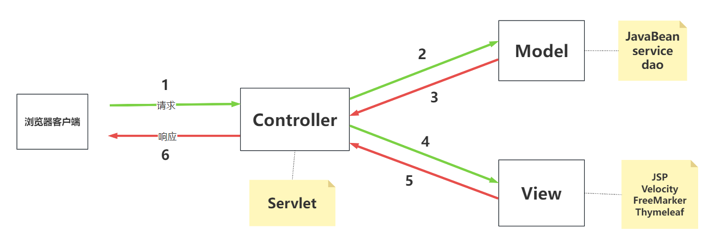
MVC架构模式的描述：前端浏览器发送请求给web服务器，web服务器中的Controller接收到用户的请求，Controller负责将前端提交的数据进行封装，然后Controller调用Model来处理业务，当Model处理完业务后会返回处理之后的数据给Controller，Controller再调用View来完成数据的展示，最终将结果响应给浏览器，浏览器进行渲染展示页面。


面试题：什么是三层模型，并说一说MVC架构模式与三层模型的区别？
三层模型：
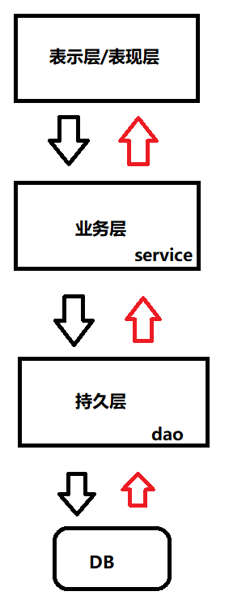                            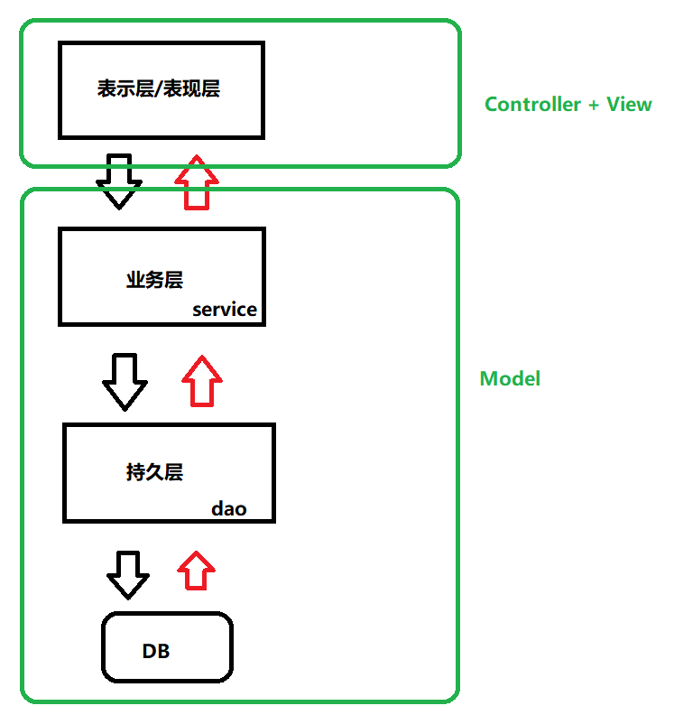

MVC 和三层模型都采用了分层结构来设计应用程序，都是降低耦合度，提高扩展力，提高组件复用性。区别在于：他们的关注点不同，三层模型更加关注业务逻辑组件的划分。
MVC架构模式关注的是整个应用程序的层次关系和分离思想。现代的开发方式大部分都是MVC架构模式结合三层模型一起用。


# 什么是SpringMVC
## SpringMVC概述
SpringMVC是一个实现了MVC架构模式的Web框架，底层基于Servlet实现。
SpringMVC已经将MVC架构模式实现了，因此只要我们是基于SpringMVC框架写代码，编写的程序就是符合MVC架构模式的。（**MVC的架子搭好了，我们只需要添添补补**）
Spring框架中有一个子项目叫做Spring Web，Spring Web子项目当中包含很多模块，例如：

- Spring MVC
- Spring WebFlux
- Spring Web Services
- Spring Web Flow
- Spring WebSocket
- Spring Web Services Client

可见 SpringMVC是Spring Web子项目当中的一个模块。因此也可以说SpringMVC是Spring框架的一部分。
所以学习SpringMVC框架之前要先学习Spring框架中的IoC和AOP等内容。
另外，使用SpringMVC框架的时候同样也可以使用IoC和AOP。
以下就是Spring官方给出的Spring架构图，其中Web中的servlet指的就是Spring MVC：
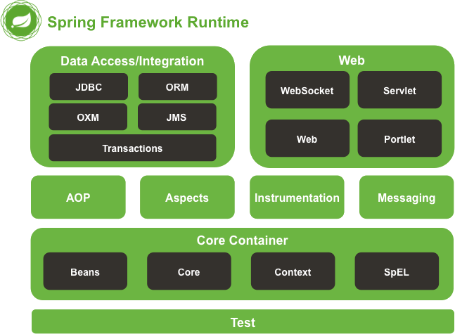


## SpringMVC帮我们做了什么
SpringMVC框架帮我们做了什么，与纯粹的Servlet开发有什么区别？

1.  入口控制：SpringMVC框架通过DispatcherServlet作为入口控制器，负责接收请求和分发请求。而在Servlet开发中，需要自己编写Servlet程序，并在web.xml中进行配置，才能接受和处理请求。 
2. 在SpringMVC中，表单提交时可以自动将表单数据绑定到相应的JavaBean对象中，只需要在控制器方法的参数列表中声明该JavaBean对象即可，无需手动获取和赋值表单数据。而在纯粹的Servlet开发中，这些都是需要自己手动完成的。
3.  IoC容器：SpringMVC框架通过IoC容器管理对象，只需要在配置文件中进行相应的配置即可获取实例对象，而在Servlet开发中需要手动创建对象实例。 
4.  统一处理请求：SpringMVC框架提供了拦截器、异常处理器等统一处理请求的机制，并且可以灵活地配置这些处理器。而在Servlet开发中，需要自行编写过滤器、异常处理器等，增加了代码的复杂度和开发难度。 
5.  视图解析：SpringMVC框架提供了多种视图模板，如JSP、Freemarker、Velocity等，并且支持国际化、主题等特性。而在Servlet开发中需要手动处理视图层，增加了代码的复杂度。 

总之，与Servlet开发相比，SpringMVC框架可以帮我们节省很多时间和精力，减少代码的复杂度，更加专注于业务开发。同时，也提供了更多的功能和扩展性，可以更好地满足企业级应用的开发需求。


## SpringMVC框架的特点

1.  轻量级：相对于其他Web框架，Spring MVC框架比较小巧轻便。（只有几个几百KB左右的Jar包文件） 
2.  模块化：请求处理过程被分成多个模块，以模块化的方式进行处理。 
   1. 控制器模块：Controller
   2. 业务逻辑模块：Model
   3. 视图模块：View
3.  依赖注入：Spring MVC框架利用Spring框架的依赖注入功能实现对象的管理，实现松散耦合。 
4.  易于扩展：提供了很多口子，允许开发者根据需要插入自己的代码，以扩展实现应用程序的特殊需求。 
   1. Spring MVC框架允许开发人员通过自定义模块和组件来扩展和增强框架的功能。
   2. Spring MVC框架与其他Spring框架及第三方框架集成得非常紧密，这使得开发人员可以非常方便地集成其他框架，以获得更好的功能。
5.  易于测试：支持单元测试框架，提高代码质量和可维护性。 （对SpringMVC中的Controller测试时，不需要依靠Web服务器。）
6.  自动化配置：提供自动化配置，减少配置细节。 
   1. Spring MVC框架基于约定大于配置的原则，对常用的配置约定进行自动化配置。
7.  灵活性：Spring MVC框架支持多种视图技术，如JSP、FreeMarker、Thymeleaf、FreeMarker等，针对不同的视图配置不同的视图解析器即可。 


# 本套教程相关版本

- JDK版本：Java21
- Maven版本：3.9.6
- Tomcat版本：10
- Spring版本：6.1.4
- SpringMVC版本：6.1.4
- IDEA版本：2023.3
- Thymeleaf版本：3.1.2


# 第一个SpringMVC程序
## 创建Maven模块
第一步：创建Empty Project，起名：springmvc。
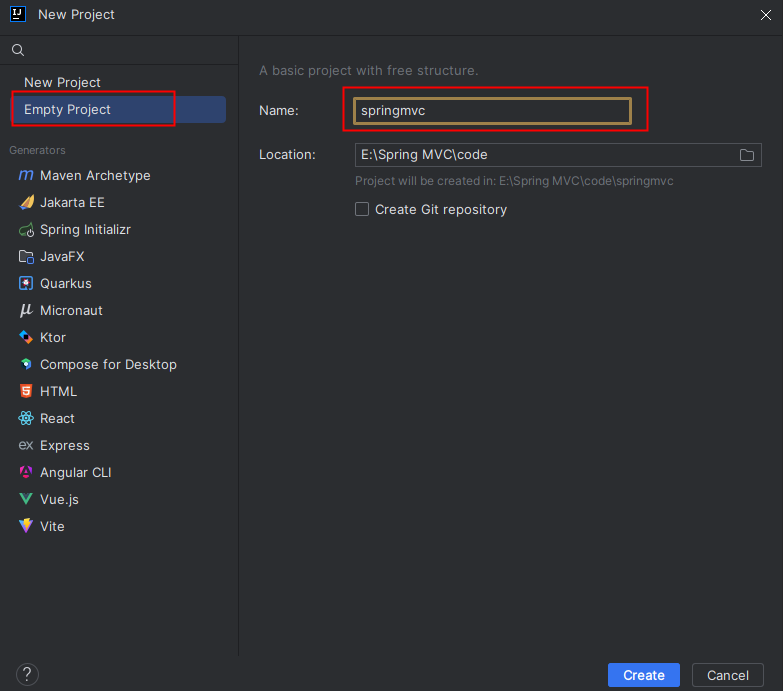
第二步：设置springmvc工程的JDK版本：Java21。
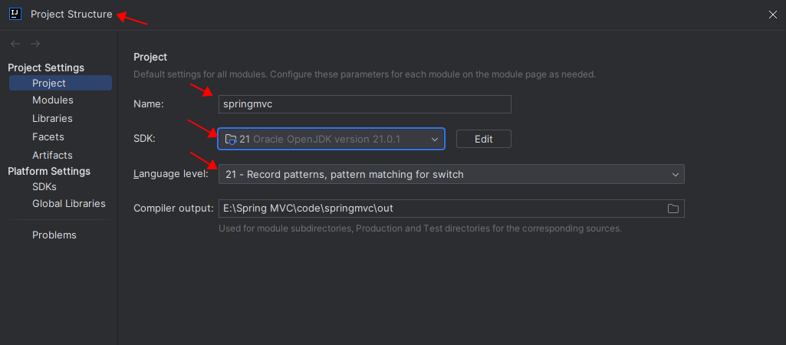
第三步：设置maven。
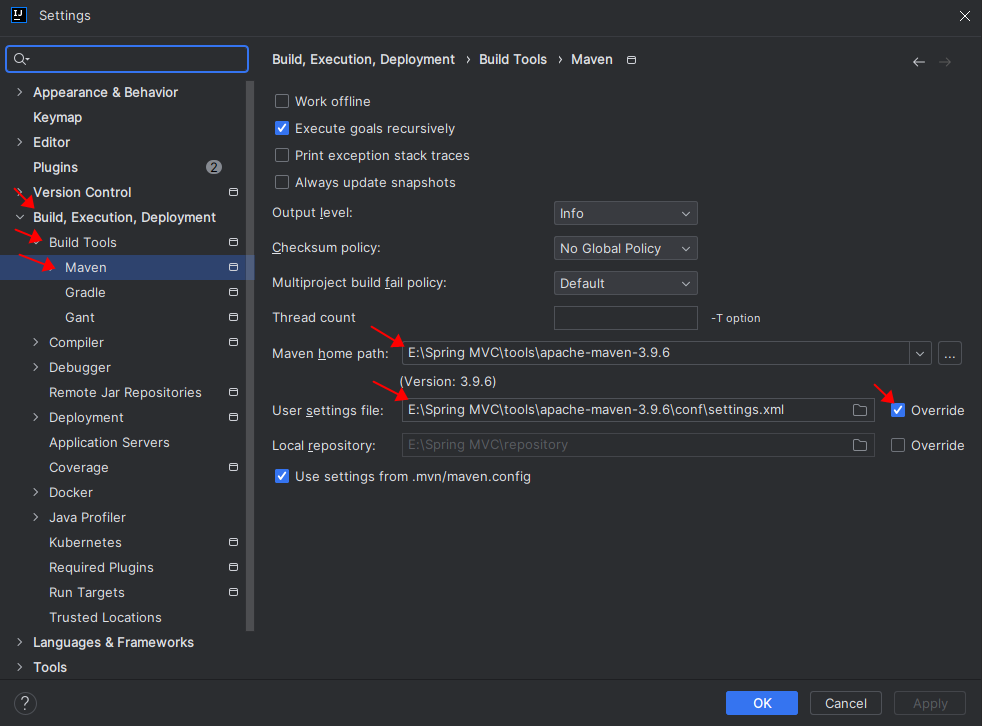
第四步：创建Maven模块

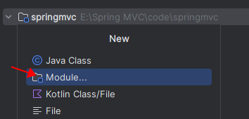


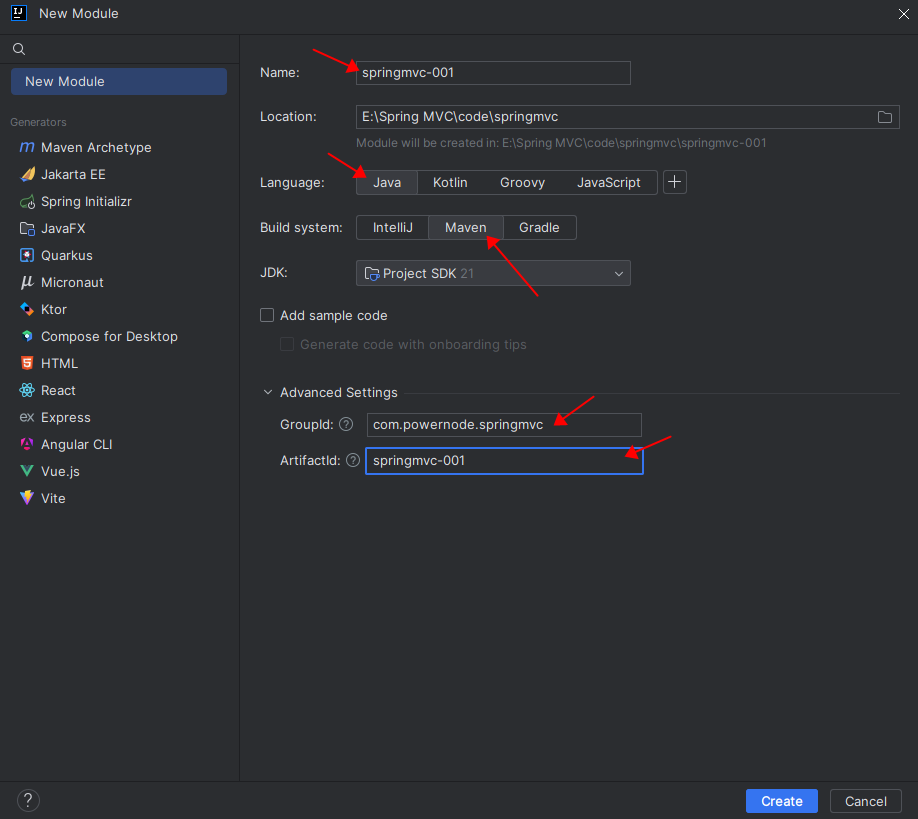
第五步：将pom.xml文件中的打包方式修改为war

```xml
<groupId>com.powernode.springmvc</groupId>
<artifactId>springmvc-001</artifactId>
<version>1.0-SNAPSHOT</version>
<!-- 打包方式设置为war方式 -->
<packaging>war</packaging>
```
第六步：添加以下依赖
```xml
<dependencies>
    <!-- Spring MVC依赖 -->
    <dependency>
        <groupId>org.springframework</groupId>
        <artifactId>spring-webmvc</artifactId>
        <version>6.1.4</version>
    </dependency>
    <!--日志框架Logback依赖-->
    <dependency>
        <groupId>ch.qos.logback</groupId>
        <artifactId>logback-classic</artifactId>
        <version>1.5.3</version>
    </dependency>
    <!--Servlet依赖-->
    <dependency>
        <groupId>jakarta.servlet</groupId>
        <artifactId>jakarta.servlet-api</artifactId>
        <version>6.0.0</version>
        <scope>provided</scope>
    </dependency>
    <!--Spring6和Thymeleaf整合依赖-->
    <dependency>
        <groupId>org.thymeleaf</groupId>
        <artifactId>thymeleaf-spring6</artifactId>
        <version>3.1.2.RELEASE</version>
    </dependency>
</dependencies>
```


## 添加web支持
第一步：在main目录下创建一个webapp目录
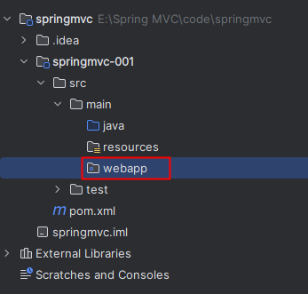
第二步：添加web.xml配置文件
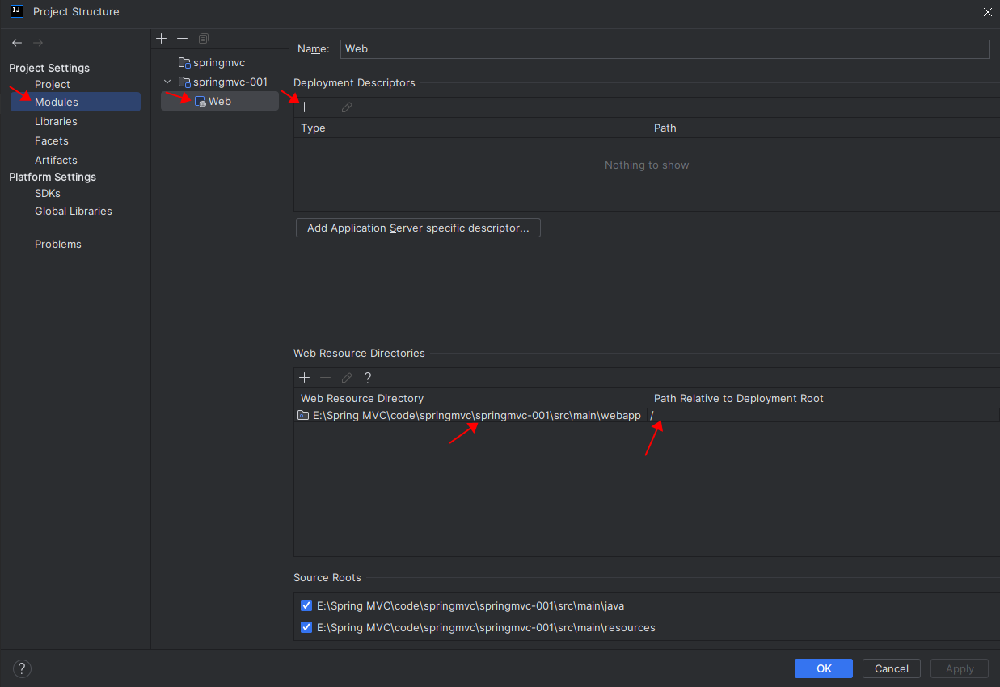
注意 web.xml 文件的位置：E:\Spring MVC\code\springmvc\springmvc-001\**src\main\webapp\WEB-INF\web.xml**
注意版本选择：6.0
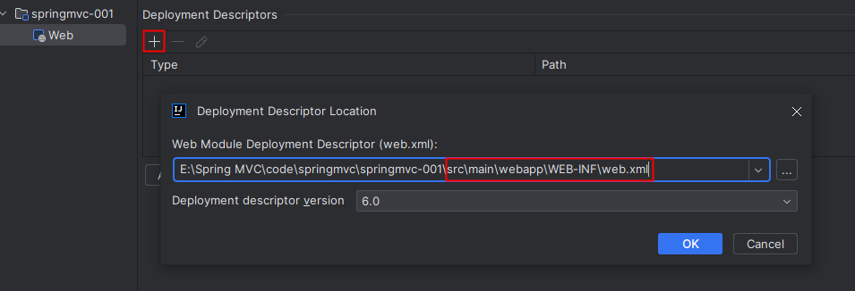
添加web支持后的目录结构：
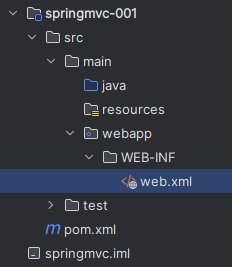


## 配置web.xml文件
Spring MVC是一个web框架，在javaweb中谁来负责接收请求，处理请求，以及响应呢？当然是Servlet。在SpringMVC框架中已经为我们写好了一个Servlet，它的名字叫做：DispatcherServlet，我们称其为前端控制器。既然是Servlet，那么它就需要在web.xml文件中进行配置：
```xml
<?xml version="1.0" encoding="UTF-8"?>
<web-app xmlns="https://jakarta.ee/xml/ns/jakartaee"
         xmlns:xsi="http://www.w3.org/2001/XMLSchema-instance"
         xsi:schemaLocation="https://jakarta.ee/xml/ns/jakartaee https://jakarta.ee/xml/ns/jakartaee/web-app_6_0.xsd"
         version="6.0">

    <!--SpringMVC提供的前端控制器-->
    <servlet>
        <servlet-name>springmvc</servlet-name>
        <servlet-class>org.springframework.web.servlet.DispatcherServlet</servlet-class>
    </servlet>
    <servlet-mapping>
        <servlet-name>springmvc</servlet-name>
        <!-- /* 表示任何一个请求都交给DispatcherServlet来处理 -->
        <!-- / 表示当请求不是xx.jsp的时候，DispatcherServlet来负责处理本次请求-->
        <!-- jsp本质就是Servlet，因此如果请求是jsp的话，应该走它自己的Servlet，而不应该走DispatcherServlet -->
        <!-- 因此我们的 url-pattern 使用 / -->
        <url-pattern>/</url-pattern>
    </servlet-mapping>

</web-app>
```

DispatcherServlet是SpringMVC框架为我们提供的最核心的类，它是整个SpringMVC框架的前端控制器，负责接收HTTP请求、将请求路由到处理程序、处理响应信息，最终将响应返回给客户端。DispatcherServlet是Web应用程序的主要入口点之一，它的职责包括：

1.  接收客户端的HTTP请求：DispatcherServlet监听来自Web浏览器的HTTP请求，然后根据请求的URL将请求数据解析为Request对象。 
2.  处理请求的URL：DispatcherServlet将请求的URL（Uniform Resource Locator）与处理程序进行匹配，确定要调用哪个控制器（Controller）来处理此请求。 
3.  调用相应的控制器：DispatcherServlet将请求发送给找到的控制器处理，控制器将执行业务逻辑，然后返回一个模型对象（Model）。 
4.  渲染视图：DispatcherServlet将调用视图引擎，将模型对象呈现为用户可以查看的HTML页面。 
5.  返回响应给客户端：DispatcherServlet将为用户生成的响应发送回浏览器，响应可以包括表单、JSON、XML、HTML以及其它类型的数据


## 编写控制器FirstController
DispatcherServlet接收到请求之后，会根据请求路径分发到对应的Controller，Controller来负责处理请求的核心业务。在SpringMVC框架中Controller是一个普通的Java类（一个普通的POJO类，不需要继承任何类或实现任何接口），需要注意的是：POJO类要纳入IoC容器来管理，POJO类的生命周期由Spring来管理，因此要使用注解标注：
```java
package com.powernode.springmvc.controller;

import org.springframework.stereotype.Controller;

/**
 * ClassName: FirstController
 * Description:
 * Datetime: 2024/3/13 11:56
 * Author: 老杜@动力节点
 * Version: 1.0
 */
@Controller
public class FirstController {
}

```


## 配置springmvc-servlet.xml文件
SpringMVC框架有它自己的配置文件，该配置文件的名字默认为：<servlet-name>-servlet.xml，默认存放的位置是WEB-INF 目录下：
```xml
<?xml version="1.0" encoding="UTF-8"?>
<beans xmlns="http://www.springframework.org/schema/beans"
       xmlns:xsi="http://www.w3.org/2001/XMLSchema-instance"
       xmlns:context="http://www.springframework.org/schema/context"
       xsi:schemaLocation="http://www.springframework.org/schema/beans http://www.springframework.org/schema/beans/spring-beans.xsd http://www.springframework.org/schema/context https://www.springframework.org/schema/context/spring-context.xsd">
    <!--组件扫描-->
    <context:component-scan base-package="com.powernode.springmvc.controller"/>
    <!--视图解析器-->
    <bean id="thymeleafViewResolver" class="org.thymeleaf.spring6.view.ThymeleafViewResolver">
        <!--作用于视图渲染的过程中，可以设置视图渲染后输出时采用的编码字符集-->
        <property name="characterEncoding" value="UTF-8"/>
        <!--如果配置多个视图解析器，它来决定优先使用哪个视图解析器，它的值越小优先级越高-->
        <property name="order" value="1"/>
        <!--当 ThymeleafViewResolver 渲染模板时，会使用该模板引擎来解析、编译和渲染模板-->
        <property name="templateEngine">
            <bean class="org.thymeleaf.spring6.SpringTemplateEngine">
                <!--用于指定 Thymeleaf 模板引擎使用的模板解析器。模板解析器负责根据模板位置、模板资源名称、文件编码等信息，加载模板并对其进行解析-->
                <property name="templateResolver">
                    <bean class="org.thymeleaf.spring6.templateresolver.SpringResourceTemplateResolver">
                        <!--设置模板文件的位置（前缀）-->
                        <property name="prefix" value="/WEB-INF/templates/"/>
                        <!--设置模板文件后缀（后缀），Thymeleaf文件扩展名不一定是html，也可以是其他，例如txt，大部分都是html-->
                        <property name="suffix" value=".html"/>
                        <!--设置模板类型，例如：HTML,TEXT,JAVASCRIPT,CSS等-->
                        <property name="templateMode" value="HTML"/>
                        <!--用于模板文件在读取和解析过程中采用的编码字符集-->
                        <property name="characterEncoding" value="UTF-8"/>
                    </bean>
                </property>
            </bean>
        </property>
    </bean>
</beans>
```
在WEB-INF目录下新建springmvc-servlet.xml文件，并且提供以上配置信息。
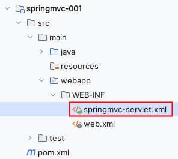
以上配置主要两项：

- 第一项：组件扫描。spring扫描这个包中的类，将这个包中的类实例化并纳入IoC容器的管理。
- 第二项：视图解析器。视图解析器（View Resolver）的作用主要是将Controller方法返回的逻辑视图名称解析成实际的视图对象。视图解析器将解析出的视图对象返回给DispatcherServlet，并最终由DispatcherServlet将该视图对象转化为响应结果，呈现给用户。

注意：如果采用了其它视图，请配置对应的视图解析器，例如：

- JSP的视图解析器：InternalResourceViewResolver
- FreeMarker视图解析器：FreeMarkerViewResolver
- Velocity视图解析器：VelocityViewResolver


## 提供视图
在WEB-INF目录下新建templates目录，在templates目录中新建html文件，例如：first.html，并提供以下代码：
```html
<!DOCTYPE html>
<!--指定 th 命名空间，让 Thymeleaf 标准表达式可以被解析和执行-->
<!--th不是固定的，可以指定其它的命名空间，只不过大部分情况下用th-->
<!--表示程序中出现的 th 开头的后面代码都是 Thymeleaf语法，需要被 Thymeleaf识别-->
<html lang="en" xmlns:th="http://www.thymeleaf.org">
<head>
    <meta charset="UTF-8">
    <title>first springmvc</title>
</head>
<body>
<h1>我的第一个Spring MVC程序</h1>
</body>
</html>
```
对于每一个Thymeleaf文件来说 xmlns:th="[http://www.thymeleaf.org"](http://www.thymeleaf.org") 是必须要写的，为了方便后续开发，可以将其添加到html模板文件中：
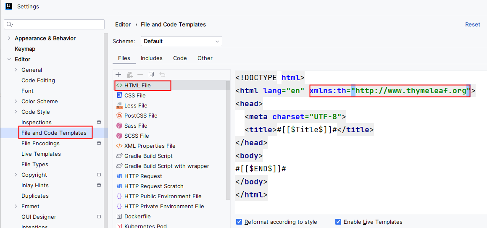


## 控制器FirstController处理请求返回逻辑视图名称
```java
package com.powernode.springmvc.controller;

import org.springframework.stereotype.Controller;
import org.springframework.web.bind.annotation.RequestMapping;

/**
 * ClassName: FirstController
 * Description:
 * Datetime: 2024/3/13 11:56
 * Author: 老杜@动力节点
 * Version: 1.0
 */
@Controller
public class FirstController {
    @RequestMapping(value="/haha")
    public String 名字随意(){
        System.out.println("正在处理请求....");
        // 返回逻辑视图名称（决定跳转到哪个页面）
        return "first";
    }
}
```


## 测试
第一步：配置Tomcat服务器
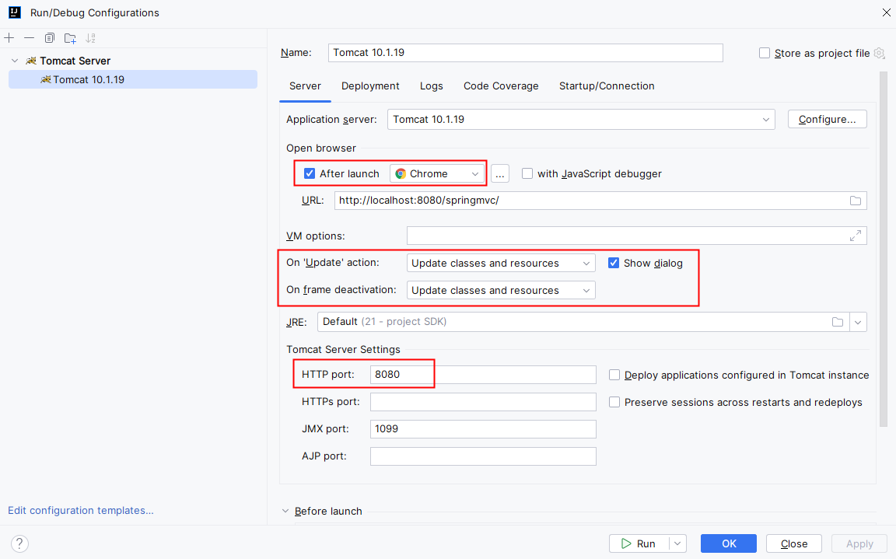
第二步：部署web模块到Tomcat服务器
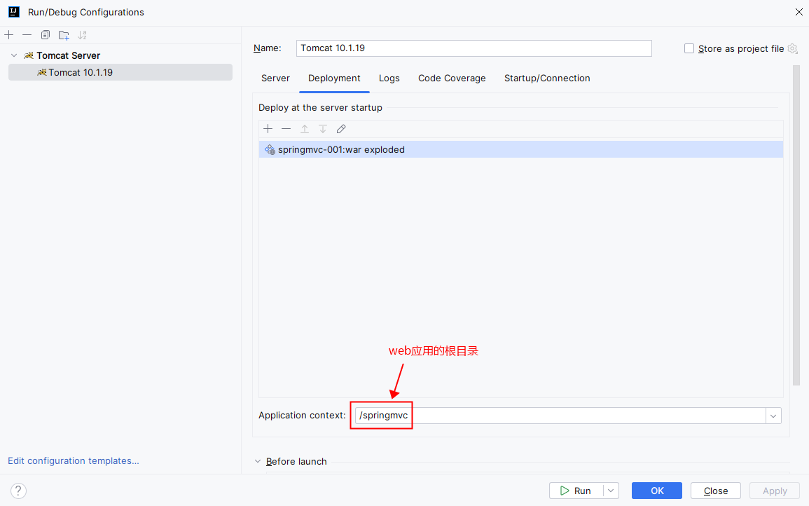
第三步：启动Tomcat服务器。如果在控制台输出的信息有中文乱码，请修改tomcat服务器配置文件：apache-tomcat-10.1.19\conf\logging.properties
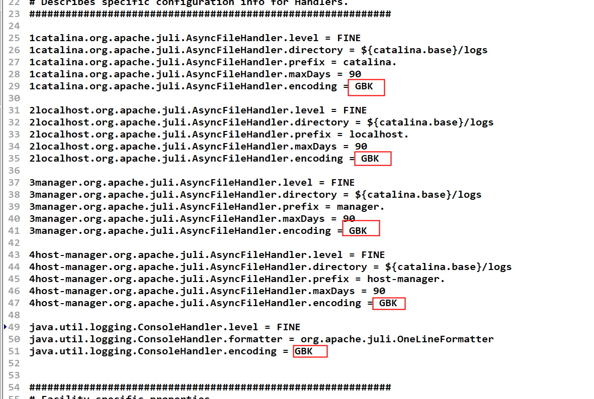
第四步：打开浏览器，在浏览器地址栏上输入地址：http://localhost:8080/springmvc/haha
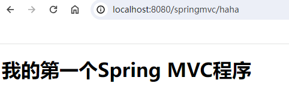
后端控制台输出：
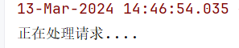


## 执行流程总结

1. 浏览器发送请求：http://localhost:8080/springmvc/haha
2. SpringMVC的前端控制器DispatcherServlet接收到请求
3. DispatcherServlet根据请求路径 /haha 映射到 FirstController#名字随意()，调用该方法
4. FirstController#名字随意() 处理请求
5. FirstController#名字随意() 返回逻辑视图名称 first 给视图解析器
6. 视图解析器找到 /WEB-INF/templates/first.html 文件，并进行解析，生成视图解析对象返回给前端控制器DispatcherServlet
7. 前端控制器DispatcherServlet响应结果到浏览器。


## 一个Controller可以编写多个方法
一个Controller可以提供多个方法，每个方法通常是处理对应的请求，例如：
```java
@Controller
public class FirstController {
    @RequestMapping(value="/haha")
    public String 名字随意(){
        System.out.println("正在处理请求....");
        // 返回逻辑视图名称（决定跳转到哪个页面）
        return "first";
    }
    
    @RequestMapping("/other")
    public String other(){
        System.out.println("正在处理其它请求...");
        return "other";
    }
}
```
提供 other.html 文件
```html
<!DOCTYPE html>
<html lang="en" xmlns:th="http://www.thymeleaf.org">
<head>
    <meta charset="UTF-8">
    <title>other</title>
</head>
<body>
<h1>other ...</h1>
</body>
</html>
```
在 first.html 文件中，添加超链接，用超链接发送 /other 请求：
```html
<!DOCTYPE html>
<!--指定 th 命名空间，让 Thymeleaf 标准表达式可以被解析和执行-->
<!--th不是固定的，可以指定其它的命名空间，只不过大部分情况下用th-->
<!--表示程序中出现的 th 开头的后面代码都是 Thymeleaf语法，需要被 Thymeleaf识别-->
<html lang="en" xmlns:th="http://www.thymeleaf.org">
<head>
    <meta charset="UTF-8">
    <title>first springmvc</title>
</head>
<body>
<h1>我的第一个Spring MVC程序</h1>
<!-- th: 表示后面的代码可以编写Thymeleaf语法，可以被Thymeleaf语法解析 -->
<!-- Thymeleaf检测到以 / 开始，表示绝对路径，自动会将webapp的上下文路径加上去 -->
<!-- 最终的效果是：href="/springmvc/other" -->
<a th:href="@{/other}">other请求</a>
</body>
</html>
```
启动Tomcat，打开浏览器，输入请求路径：http://localhost:8080/springmvc/haha
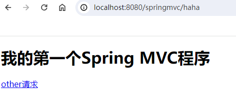
点击超链接：other请求
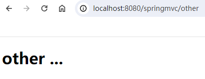


# 第二个SpringMVC程序
## 创建Maven模块

1. pom.xml文件中添加依赖
   1. springmvc依赖
   2. logback依赖
   3. servlet依赖（scope为provided）
   4. thymeleaf与spring6整合依赖
2. 打包方式war


## 添加web支持
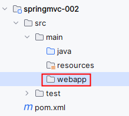
webapp目录没有小蓝点怎么办？添加web支持
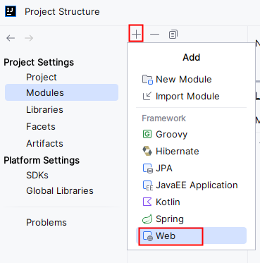
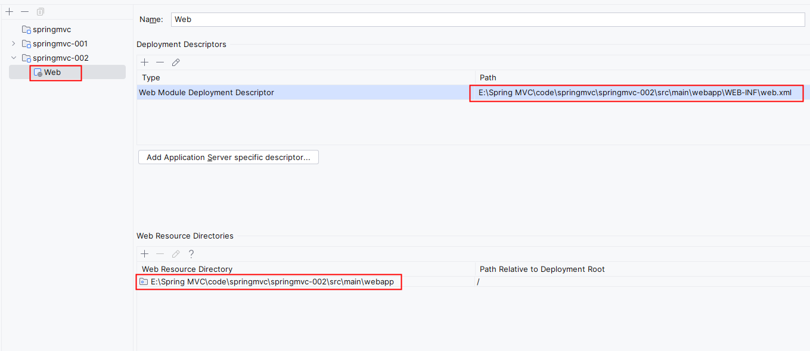


## 配置web.xml文件
重点：SpringMVC配置文件的名字和路径是可以手动设置的，如下：
```xml
<?xml version="1.0" encoding="UTF-8"?>
<web-app xmlns="http://xmlns.jcp.org/xml/ns/javaee"
         xmlns:xsi="http://www.w3.org/2001/XMLSchema-instance"
         xsi:schemaLocation="http://xmlns.jcp.org/xml/ns/javaee http://xmlns.jcp.org/xml/ns/javaee/web-app_4_0.xsd"
         version="4.0">
    <!--配置前端控制器-->
    <servlet>
        <servlet-name>springmvc</servlet-name>
        <servlet-class>org.springframework.web.servlet.DispatcherServlet</servlet-class>
        <!--手动设置springmvc配置文件的路径及名字-->
        <init-param>
            <param-name>contextConfigLocation</param-name>
            <param-value>classpath:springmvc.xml</param-value>
        </init-param>
        <!--为了提高用户的第一次访问效率，建议在web服务器启动时初始化前端控制器-->
        <load-on-startup>1</load-on-startup>
    </servlet>
    <servlet-mapping>
        <servlet-name>springmvc</servlet-name>
        <url-pattern>/</url-pattern>
    </servlet-mapping>
</web-app>
```
**通过<init-param>来设置SpringMVC配置文件的路径和名字。在DispatcherServlet的init方法执行时设置的。**
**<load-on-startup>1</load-on-startup>建议加上，这样可以提高用户第一次访问的效率。表示在web服务器启动时初始化DispatcherServlet。**


## 编写IndexController
```java
package com.powernode.springmvc.controller;

import org.springframework.stereotype.Controller;
import org.springframework.web.bind.annotation.RequestMapping;

/**
 * ClassName: IndexController
 * Description:
 * Datetime: 2024/3/13 15:47
 * Author: 老杜@动力节点
 * Version: 1.0
 */
@Controller
public class IndexController {
    @RequestMapping("/")
    public String toIndex(){
        return "index";
    }
}
```
表示请求路径如果是：[http://localhost:8080/springmvc/](http://localhost:8080/springmvc/) ，则进入 /WEB-INF/templates/index.html 页面。
**这就是项目的首页效果！！！！！**


## 在resources目录下配置springmvc.xml文件
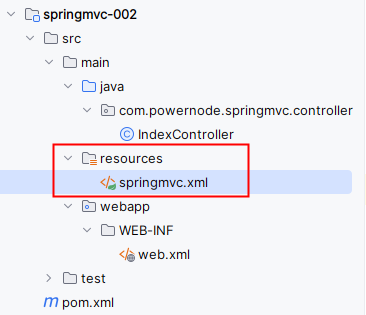
配置内容和之前一样，一个是视图解析器，一个是组件扫描。


## 提供视图
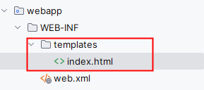
```html
<!DOCTYPE html>
<html lang="en" xmlns:th="http://www.thymeleaf.org">
<head>
    <meta charset="UTF-8">
    <title>index page</title>
</head>
<body>
<h1>index page</h1>
</body>
</html>
```


## 测试
部署到web服务器，启动web服务器，打开浏览器，在地址栏上输入：[http://localhost:8080/springmvc/](http://localhost:8080/springmvc/)
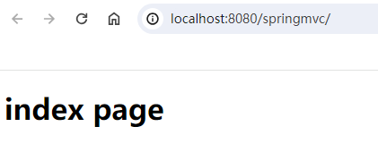
