# RequestMapping的作用
`@RequestMapping` 注解是 Spring MVC 框架中的一个控制器映射注解，用于将请求映射到相应的处理方法上。具体来说，它可以将指定 URL 的请求绑定到一个特定的方法或类上，从而实现对请求的处理和响应。


# RequestMapping的出现位置
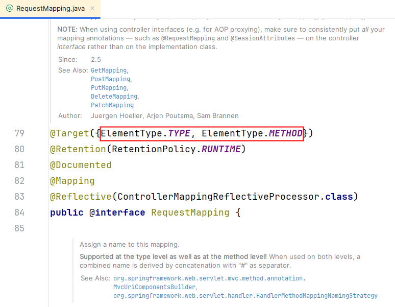
通过RequestMapping的源码可以看到RequestMapping注解只能出现在类上或者方法上。


# 类上与方法上结合使用
我们先来看，在同一个web应用中，是否可以有两个完全一样的RequestMapping。测试一下：假设两个RequestMapping，其中一个是展示用户详细信息，另一个是展示商品详细信息。提供两个Controller，一个是UserController，另一个是ProductController。如下：
```java
package com.powernode.springmvc.controller;

import org.springframework.stereotype.Controller;
import org.springframework.web.bind.annotation.RequestMapping;

/**
 * ClassName: UserController
 * Description:
 * Datetime: 2024/3/13 16:40
 * Author: 老杜@动力节点
 * Version: 1.0
 */
@Controller
public class UserController {
    @RequestMapping("/detail")
    public String toDetail(){
        return "detail";
    }
}

```
```java
package com.powernode.springmvc.controller;

import org.springframework.stereotype.Controller;
import org.springframework.web.bind.annotation.RequestMapping;

/**
 * ClassName: ProductController
 * Description:
 * Datetime: 2024/3/13 16:40
 * Author: 老杜@动力节点
 * Version: 1.0
 */
@Controller
public class ProductController {
    @RequestMapping("/detail")
    public String toDetail(){
        return "detail";
    }
}

```
以上两个Controller的RequestMapping相同，都是"/detail"，我们来启动服务器看会不会出现问题：异常发生了，异常信息如下
```java
org.springframework.beans.factory.BeanCreationException: 
Error creating bean with name 'org.springframework.web.servlet.mvc.method.annotation.RequestMappingHandlerMapping': 
Ambiguous mapping. Cannot map 'userController' method 
com.powernode.springmvc.controller.UserController#toDetail()
to { [/detail]}: There is already 'productController' bean method
com.powernode.springmvc.controller.ProductController#toDetail() mapped.
```
以上异常信息大致的意思是：不明确的映射。无法映射UserController中的toDetail()方法，因为已经在ProductController中映射过了！！！！
通过测试得知，在同一个webapp中，RequestMapping必须具有唯一性。怎么解决以上问题？两种解决方案：

- 第一种方案：将方法上RequestMapping的映射路径修改的不一样。
- 第二种方案：在类上添加RequestMapping的映射路径，以类上的RequestMapping作为命名空间，来加以区分两个不同的映射。


## 第一种方案
将方法上RequestMapping的映射路径修改的不一样。
```java
@RequestMapping("/user/detail")
public String toDetail(){
    return "/user/detail";
}
```
```java
@RequestMapping("/product/detail")
public String toDetail(){
    return "/product/detail";
}
```
再次启动web服务器，会发现没有再报错了。
为这两个请求分别提供对应的视图页面：
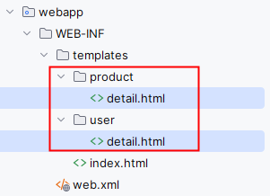
```html
<!DOCTYPE html>
<html lang="en" xmlns:th="http://www.thymeleaf.org">
<head>
    <meta charset="UTF-8">
    <title>商品详情页面</title>
</head>
<body>
<h1>商品详情</h1>
</body>
</html>
```
```html
<!DOCTYPE html>
<html lang="en" xmlns:th="http://www.thymeleaf.org">
<head>
    <meta charset="UTF-8">
    <title>用户详情页面</title>
</head>
<body>
<h1>用户详情</h1>
</body>
</html>
```
在首页面添加两个超链接：
```html
<!DOCTYPE html>
<html lang="en" xmlns:th="http://www.thymeleaf.org">
<head>
    <meta charset="UTF-8">
    <title>index page</title>
</head>
<body>
<h1>index page</h1>
<a th:href="@{/user/detail}">用户详情</a><br>
<a th:href="@{/product/detail}">商品详情</a><br>
</body>
</html>
```
启动Tomcat服务器，并测试：http://localhost:8080/springmvc/
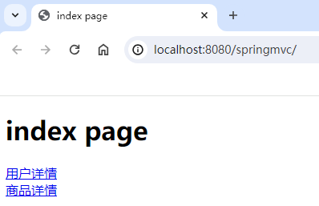
点击用户详情，点击商品详情，都可以正常显示：
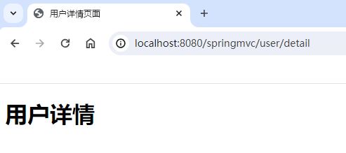
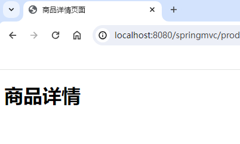


## 第二种方案
在类上和方法上都使用RequestMapping注解来进行路径的映射。假设在类上映射的路径是"/a"，在方法上映射的路径是"/b"，那么整体表示映射的路径就是："/a/b"
在第一种方案中，假设UserController类中有很多方法，每个方法的 RequestMapping注解中都需要以"/user"开始，显然比较啰嗦，干脆将"/user"提升到类级别上，例如：
```java
package com.powernode.springmvc.controller;

import org.springframework.stereotype.Controller;
import org.springframework.web.bind.annotation.RequestMapping;

/**
 * ClassName: UserController
 * Description:
 * Datetime: 2024/3/13 16:40
 * Author: 老杜@动力节点
 * Version: 1.0
 */
@Controller
@RequestMapping("/user")
public class UserController {
    @RequestMapping("/detail")
    public String toDetail(){
        return "/user/detail";
    }
}

```
```java
package com.powernode.springmvc.controller;

import org.springframework.stereotype.Controller;
import org.springframework.web.bind.annotation.RequestMapping;

/**
 * ClassName: ProductController
 * Description:
 * Datetime: 2024/3/13 16:40
 * Author: 老杜@动力节点
 * Version: 1.0
 */
@Controller
@RequestMapping("/product")
public class ProductController {
    @RequestMapping("/detail")
    public String toDetail(){
        return "/product/detail";
    }
}

```
经过测试，程序可以正常执行！！！


# RequestMapping注解的value属性
## value属性的使用
value属性是该注解最核心的属性，value属性填写的是请求路径，也就是说通过该请求路径与对应的控制器的方法绑定在一起。另外通过源码可以看到value属性是一个字符串数组：
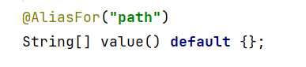
既然是数组，就表示可以提供多个路径，也就是说，在SpringMVC中，多个不同的请求路径可以映射同一个控制器的同一个方法：
编写新的控制器：
```java
package com.powernode.springmvc.controller;

import org.springframework.stereotype.Controller;
import org.springframework.web.bind.annotation.RequestMapping;

/**
 * ClassName: RequestMappingTestController
 * Description: 测试 RequestMapping 注解
 * Datetime: 2024/3/14 9:14
 * Author: 老杜@动力节点
 * Version: 1.0
 */
@Controller
public class RequestMappingTestController {
    @RequestMapping(value = {"/testValue1", "/testValue2"})
    public String testValue(){
        return "testValue";
    }
}

```
提供视图页面：
```html
<!DOCTYPE html>
<html lang="en" xmlns:th="http://www.thymeleaf.org">
<head>
    <meta charset="UTF-8">
    <title>test Value</title>
</head>
<body>
<h1>Test RequestMapping's Value</h1>
</body>
</html>
```
在index.html文件中添加两个超链接：
```html
<!DOCTYPE html>
<html lang="en" xmlns:th="http://www.thymeleaf.org">
<head>
    <meta charset="UTF-8">
    <title>index page</title>
</head>
<body>
<h1>index page</h1>
<a th:href="@{/user/detail}">用户详情</a><br>
<a th:href="@{/product/detail}">商品详情</a><br>

<!--测试RequestMapping的value属性-->
<a th:href="@{/testValue1}">testValue1</a><br>
<a th:href="@{/testValue2}">testValue2</a><br>

</body>
</html>
```
启动服务器，测试，点击以下的两个超链接，发送请求，都可以正常访问到同一个控制器上的同一个方法：

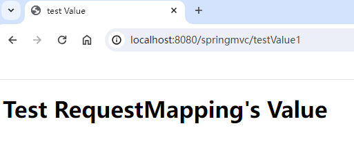
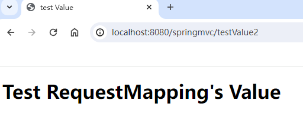


## Ant风格的value
value是可以用来匹配路径的，路径支持模糊匹配，我们把这种模糊匹配称之为Ant风格。关于路径中的通配符包括：

- ?，代表任意一个字符
- *，代表0到N个任意字符
- **，代表0到N个任意字符，并且路径中可以出现路径分隔符 /

注意：** 通配符在使用时，左右不能出现字符，只能是 /

测试一下这些通配符，在 RequestMappingTestController 中添加以下方法：
```java
@RequestMapping("/x?z/testValueAnt")
public String testValueAnt(){
    return "testValueAnt";
}
```
提供视图页面：
```html
<!DOCTYPE html>
<html lang="en" xmlns:th="http://www.thymeleaf.org">
<head>
    <meta charset="UTF-8">
    <title>test Value Ant</title>
</head>
<body>
<h1>测试RequestMapping注解的value属性支持模糊匹配</h1>
</body>
</html>
```
在index.html页面中编写超链接：
```html
<!--测试RequestMapping注解的value属性支持模糊匹配-->
<a th:href="@{/xyz/testValueAnt}">测试value属性的模糊匹配</a><br>
```
测试结果如下：
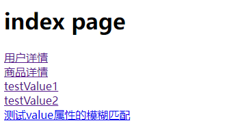
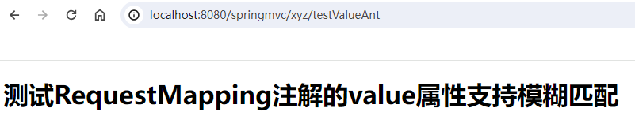


通过修改浏览器地址栏上的路径，可以反复测试通配符 ? 的语法：
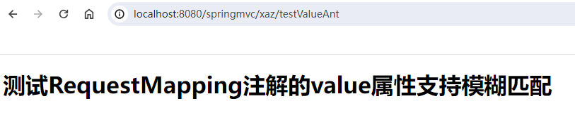
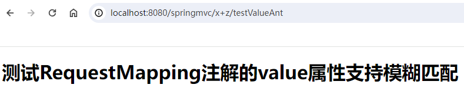
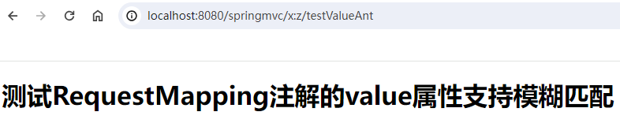


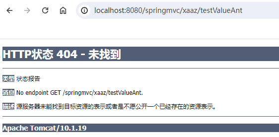
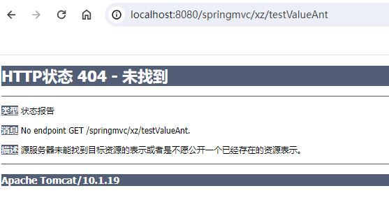
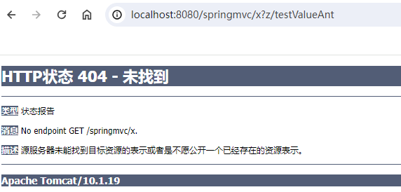


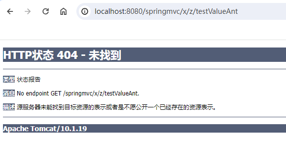

将 ? 通配符修改为 * 通配符：
```java
//@RequestMapping("/x?z/testValueAnt")
@RequestMapping("/x*z/testValueAnt")
public String testValueAnt(){
    return "testValueAnt";
}
```
打开浏览器直接在地址栏上输入路径进行测试：
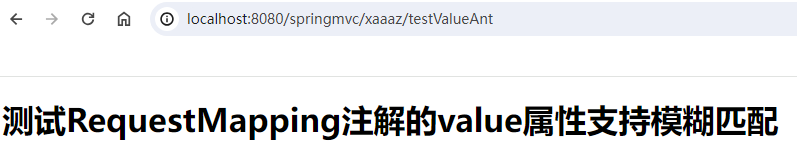
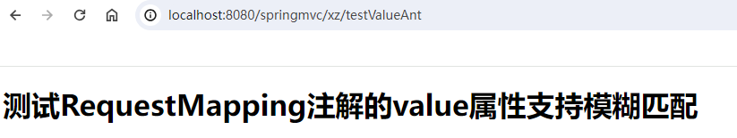


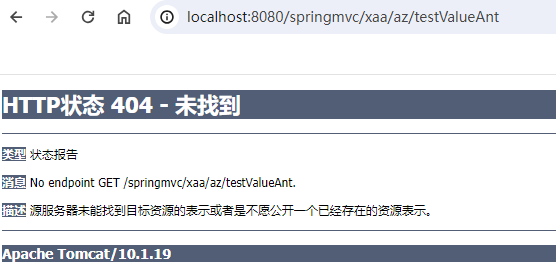

将 * 通配符修改为 ** 通配符：
```java
@RequestMapping("/x**z/testValueAnt")
public String testValueAnt(){
    return "testValueAnt";
}
```
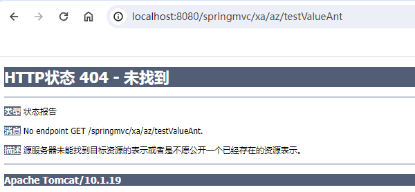


注意：/x**z/ 实际上并没有使用通配符 **，本质上还是使用的 *，因为通配符 ** 在使用的时候，左右两边都不能有任何字符，必须是 /。
```java
@RequestMapping("/**/testValueAnt")
public String testValueAnt(){
    return "testValueAnt";
}
```
启动服务器发现报错了：
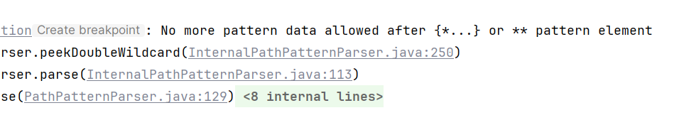
以上写法在Spring5的时候是支持的，但是在Spring6中进行了严格的规定，** 通配符只能出现在路径的末尾，例如：
```java
@RequestMapping("/testValueAnt/**")
public String testValueAnt(){
    return "testValueAnt";
}
```
测试结果：
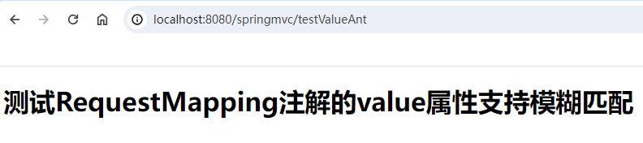
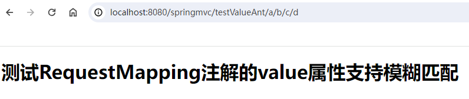


## value中的占位符（重点）
到目前为止，我们的请求路径是这样的格式：uri?name1=value1&name2=value2&name3=value3
其实除了这种方式，还有另外一种格式的请求路径，格式为：uri/value1/value2/value3，我们将这样的请求路径叫做 RESTful 风格的请求路径。
RESTful风格的请求路径在现代的开发中使用较多。

普通的请求路径：http://localhost:8080/springmvc/login?username=admin&password=123&age=20
RESTful风格的请求路径：http://localhost:8080/springmvc/login/admin/123/20

如果使用RESTful风格的请求路径，在控制器中应该如何获取请求中的数据呢？可以在value属性中使用占位符，例如：/login/{id}/{username}/{password}

在 RequestMappingTestController 类中添加一个方法：
```java
@RequestMapping(value="/testRESTful/{id}/{username}/{age}")
public String testRESTful(
        @PathVariable("id")
        int id,
        @PathVariable("username")
        String username,
        @PathVariable("age")
        int age){
    System.out.println(id + "," + username + "," + age);
    return "testRESTful";
}
```
提供视图页面：
```html
<!DOCTYPE html>
<html lang="en" xmlns:th="http://www.thymeleaf.org">
<head>
    <meta charset="UTF-8">
    <title>test RESTful</title>
</head>
<body>
<h1>测试value属性使用占位符</h1>
</body>
</html>
```
在 index.html 页面中添加超链接：
```html
<!--测试RequestMapping注解的value属性支持占位符-->
<a th:href="@{/testRESTful/1/zhangsan/20}">测试value属性使用占位符</a>
```

启动服务器测试：
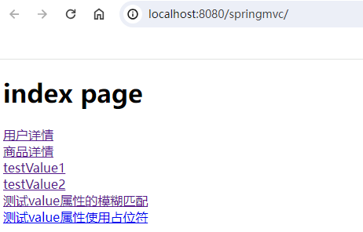
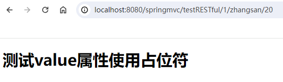
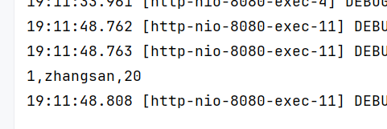


# RequestMapping注解的method属性
## method属性的作用
在Servlet当中，如果后端要求前端必须发送一个post请求，后端可以通过重写doPost方法来实现。后端要求前端必须发送一个get请求，后端可以通过重写doGet方法来实现。当重写的方法是doPost时，前端就必须发送post请求，当重写doGet方法时，前端就必须发送get请求。如果前端发送请求的方式和后端的处理方式不一致时，会出现405错误。

HTTP状态码405，这种机制的作用是：限制客户端的请求方式，以保证服务器中数据的安全。

假设后端程序要处理的请求是一个登录请求，为了保证登录时的用户名和密码不被显示到浏览器的地址栏上，后端程序有义务要求前端必须发送一个post请求，如果前端发送get请求，则应该拒绝。

那么在SpringMVC框架中应该如何实现这种机制呢？可以使用RequestMapping注解的method属性来实现。

通过RequestMapping源码可以看到，method属性也是一个数组：
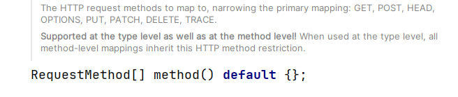
数组中的每个元素是 RequestMethod，而RequestMethod是一个枚举类型的数据：
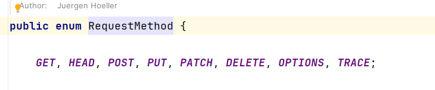
因此如果要求前端发送POST请求，该注解应该这样用：
```java
@RequestMapping(value = "/login", method = RequestMethod.POST)
public String login(){
    return "success";
}
```

接下来，我们来测试一下：
在RequestMappingTestController类中添加以下方法：
```java
@RequestMapping(value="/login", method = RequestMethod.POST)
public String testMethod(){
    return "testMethod";
}
```
提供视图页面：
```html
<!DOCTYPE html>
<html lang="en" xmlns:th="http://www.thymeleaf.org">
<head>
    <meta charset="UTF-8">
    <title>test Method</title>
</head>
<body>
<h1>Login Success!!!</h1>
</body>
</html>
```


在index.html页面中提供一个登录的form表单，后端要求发送post请求，则form表单的method属性应设置为post：
```html
<!--测试RequestMapping的method属性-->
<form th:action="@{/login}" method="post">
    用户名：<input type="text" name="username"/><br>
    密码：<input type="password" name="password"/><br>
    <input type="submit" value="登录">
</form>
```
启动服务器，测试：
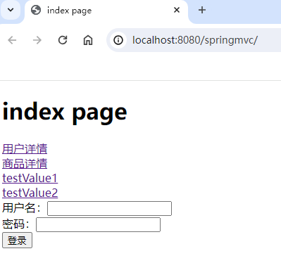
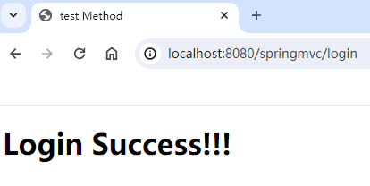


通过测试，前端发送的请求方式post，后端处理请求的方式也是post，就不会有问题。
当然，如果后端要求前端必须发送post请求，而前端发送了get请求，则会出现405错误，将index.html中form表单提交方式修改为get：
```html
<!--测试RequestMapping的method属性-->
<form th:action="@{/login}" method="get">
    用户名：<input type="text" name="username"/><br>
    密码：<input type="password" name="password"/><br>
    <input type="submit" value="登录">
</form>
```
再次测试：
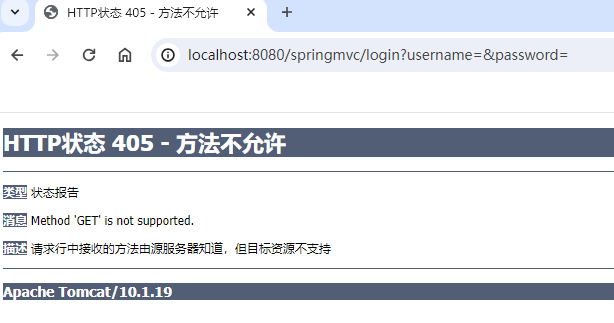

**因此，可以看出，对于RequestMapping注解来说，多一个属性，就相当于多了一个映射的条件，如果value和method属性都有，则表示只有前端发送的请求路径 + 请求方式都满足时才能与控制器上的方法建立映射关系，只要有一个不满足，则无法建立映射关系。例如：@RequestMapping(value="/login", method = RequestMethod.POST) 表示当前端发送的请求路径是 /login，并且发送请求的方式是POST的时候才会建立映射关系。如果前端发送的是get请求，或者前端发送的请求路径不是 /login，则都是无法建立映射的。**


## 衍生Mapping
对于以上的程序来说，SpringMVC提供了另一个注解，使用这个注解更加的方便，它就是：PostMapping，使用该注解时，不需要指定method属性，因为它默认采用的就是POST处理方式：修改RequestMappingTestController代码如下
```java
//@RequestMapping(value="/login", method = RequestMethod.POST)
@PostMapping("/login")
public String testMethod(){
    return "testMethod";
}
```
当前端发送get请求时，测试一下：
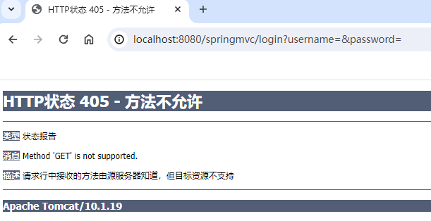
当前端发送post请求时，测试一下：
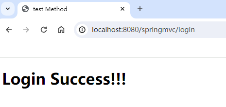

在SpringMVC中不仅提供了 **PostMaping**注解，像这样的注解还有四个，包括：

- **GetMapping**：要求前端必须发送get请求
- **PutMapping**：要求前端必须发送put请求
- **DeleteMapping**：要求前端必须发送delete请求
- **PatchMapping**：要求前端必须发送patch请求


## web的请求方式
前端向服务器发送请求的方式包括哪些？共9种，前5种常用，后面作为了解：

- **GET：获取资源，只允许读取数据，不影响数据的状态和功能。使用 URL 中传递参数或者在 HTTP 请求的头部使用参数，服务器返回请求的资源。**
- **POST：向服务器提交资源，可能还会改变数据的状态和功能。通过表单等方式提交请求体，服务器接收请求体后，进行数据处理。**
- **PUT：更新资源，用于更新指定的资源上所有可编辑内容。通过请求体发送需要被更新的全部内容，服务器接收数据后，将被更新的资源进行替换或修改。**
- **DELETE：删除资源，用于删除指定的资源。将要被删除的资源标识符放在 URL 中或请求体中。**
- **HEAD：请求服务器返回资源的头部，与 GET 命令类似，但是所有返回的信息都是头部信息，不能包含数据体。主要用于资源检测和缓存控制。**
- PATCH：部分更改请求。当被请求的资源是可被更改的资源时，请求服务器对该资源进行部分更新，即每次更新一部分。
- OPTIONS：请求获得服务器支持的请求方法类型，以及支持的请求头标志。“OPTIONS *”则返回支持全部方法类型的服务器标志。
- TRACE：服务器响应输出客户端的 HTTP 请求，主要用于调试和测试。
- CONNECT：建立网络连接，通常用于加密 SSL/TLS 连接。

注意：

1. 使用超链接以及原生的form表单只能提交get和post请求，put、delete、head请求可以使用发送ajax请求的方式来实现。
2. 使用超链接发送的是get请求
3. 使用form表单，如果没有设置method，发送get请求
4. 使用form表单，设置method="get"，发送get请求
5. 使用form表单，设置method="post"，发送post请求
6. **使用form表单，设置method="put/delete/head"，发送get请求。（针对这种情况，可以测试一下）**


将index.html中登录表单的提交方式method设置为put：
```html
<!--测试RequestMapping的method属性-->
<form th:action="@{/login}" method="put">
    用户名：<input type="text" name="username"/><br>
    密码：<input type="password" name="password"/><br>
    <input type="submit" value="登录">
</form>
```
修改RequestMappingTestController类的代码：
```java
@RequestMapping(value="/login", method = RequestMethod.PUT)
//@PostMapping("/login")
public String testMethod(){
    return "testMethod";
}
```
测试结果：
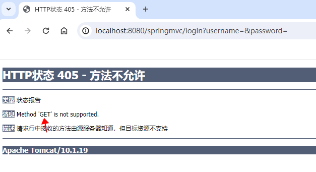
通过测试得知，即使form中method设置为put方式，但仍然采用get方式发送请求。
再次修改RequestMappingTestController：
```java
@RequestMapping(value="/login", method = RequestMethod.GET)
//@PostMapping("/login")
public String testMethod(){
    return "testMethod";
}
```
再次测试：
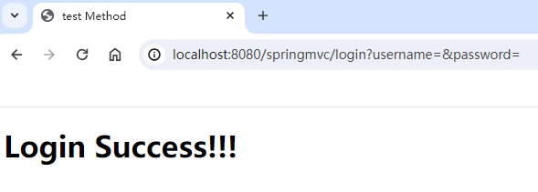


## GET和POST的区别
在之前发布的JavaWEB视频中对HTTP请求协议的GET和POST进行了详细讲解，这里就不再赘述，大致回顾一下。
HTTP请求协议之GET请求：
```
GET /springmvc/login?username=lucy&userpwd=1111 HTTP/1.1                           请求行
Host: localhost:8080                                                                    请求头
Connection: keep-alive
sec-ch-ua: "Google Chrome";v="95", "Chromium";v="95", ";Not A Brand";v="99"
sec-ch-ua-mobile: ?0
sec-ch-ua-platform: "Windows"
Upgrade-Insecure-Requests: 1
User-Agent: Mozilla/5.0 (Windows NT 10.0; Win64; x64) AppleWebKit/537.36 (KHTML, like Gecko) Chrome/95.0.4638.54 Safari/537.36
Accept: text/html,application/xhtml+xml,application/xml;q=0.9,image/avif,image/webp,image/apng,*/*;q=0.8,application/signed-exchange;v=b3;q=0.9
Sec-Fetch-Site: same-origin
Sec-Fetch-Mode: navigate
Sec-Fetch-User: ?1
Sec-Fetch-Dest: document
Referer: http://localhost:8080/springmvc/index.html
Accept-Encoding: gzip, deflate, br
Accept-Language: zh-CN,zh;q=0.9
                                                                                        空白行
                                                                                        请求体
```
HTTP请求协议之POST请求：
```
POST /springmvc/login HTTP/1.1                                                  请求行
Host: localhost:8080                                                                  请求头
Connection: keep-alive
Content-Length: 25
Cache-Control: max-age=0
sec-ch-ua: "Google Chrome";v="95", "Chromium";v="95", ";Not A Brand";v="99"
sec-ch-ua-mobile: ?0
sec-ch-ua-platform: "Windows"
Upgrade-Insecure-Requests: 1
Origin: http://localhost:8080
Content-Type: application/x-www-form-urlencoded
User-Agent: Mozilla/5.0 (Windows NT 10.0; Win64; x64) AppleWebKit/537.36 (KHTML, like Gecko) Chrome/95.0.4638.54 Safari/537.36
Accept: text/html,application/xhtml+xml,application/xml;q=0.9,image/avif,image/webp,image/apng,*/*;q=0.8,application/signed-exchange;v=b3;q=0.9
Sec-Fetch-Site: same-origin
Sec-Fetch-Mode: navigate
Sec-Fetch-User: ?1
Sec-Fetch-Dest: document
Referer: http://localhost:8080/springmvc/index.html
Accept-Encoding: gzip, deflate, br
Accept-Language: zh-CN,zh;q=0.9
                                                                                      空白行
username=lisi&userpwd=123                                                             请求体
```


### 区别是什么

1. get请求发送数据的时候，数据会挂在URI的后面，并且在URI后面添加一个“?”，"?"后面是数据。这样会导致发送的数据回显在浏览器的地址栏上。

[http://localhost:8080/springmvc/login?username=zhangsan&userpwd=1111](http://localhost:8080/servlet05/getServlet?username=zhangsan&userpwd=1111)

2. post请求发送数据的时候，在请求体当中发送。不会回显到浏览器的地址栏上。也就是说post发送的数据，在浏览器地址栏上看不到。
3. get请求只能发送普通的字符串。并且发送的字符串长度有限制，不同的浏览器限制不同。这个没有明确的规范。get请求无法发送大数据量。
4. post请求可以发送任何类型的数据，包括普通字符串，流媒体等信息：视频、声音、图片。post请求可以发送大数据量，理论上没有长度限制。
5. get请求在W3C中是这样说的：get请求比较适合从服务器端获取数据。
6. post请求在W3C中是这样说的：post请求比较适合向服务器端传送数据。
7. get请求是安全的。因为在正确使用get请求的前提下，get请求只是为了从服务器上获取数据，不会对服务器数据进行修改。
8. post请求是危险的。因为post请求是修改服务器端的资源。
9. get请求支持缓存。 也就是说当第二次发送get请求时，会走浏览器上次的缓存结果，不再真正的请求服务器。（有时需要避免，怎么避免：在get请求路径后添加时间戳）
10. post请求不支持缓存。每一次发送post请求都会真正的走服务器。


### 怎么选择

1. 如果你是想从服务器上获取资源，建议使用GET请求，如果你这个请求是为了向服务器提交数据，建议使用POST请求。
2. 大部分的form表单提交，都是post方式，因为form表单中要填写大量的数据，这些数据是收集用户的信息，一般是需要传给服务器，服务器将这些数据保存/修改等。
3. 如果表单中有敏感信息，建议使用post请求，因为get请求会回显敏感信息到浏览器地址栏上。（例如：密码信息）
4. 做文件上传，一定是post请求。要传的数据不是普通文本。
5. 其他情况大部分都是使用get请求。


# RequestMapping注解的params属性
## params属性的理解
params属性用来设置通过请求参数来映射请求。
对于RequestMapping注解来说：

- value属性是一个数组，只要满足数组中的任意一个路径，就能映射成功
- method属性也是一个数组，只要满足数组中任意一个请求方式，就能映射成功。
- **params属性也是一个数组，不过要求请求参数必须和params数组中要求的所有参数完全一致后，才能映射成功。**

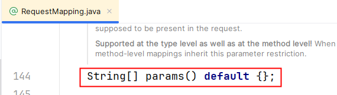


## params属性的4种用法
@RequestMapping(value="/login", params={**"username"**, "password"}) 表示：请求参数中必须包含 username 和 password，才能与当前标注的方法进行映射。
@RequestMapping(value="/login", params={**"!username"**, "password"}) 表示：请求参数中不能包含username参数，但必须包含password参数，才能与当前标注的方法进行映射。
@RequestMapping(value="/login", params={**"username=admin"**, "password"}) 表示：请求参数中必须包含username参数，并且参数的值必须是admin，另外也必须包含password参数，才能与当前标注的方法进行映射。
@RequestMapping(value="/login", params={**"username!=admin"**, "password"}) 表示：请求参数中必须包含username参数，但参数的值不能是admin，另外也必须包含password参数，才能与当前标注的方法进行映射。

注意：如果前端提交的参数，和后端要求的请求参数不一致，则出现400错误！！！
**HTTP状态码400的原因：请求参数格式不正确而导致的。**


## 测试params属性
在 RequestMappingTestController 类中添加如下方法：
```java
@RequestMapping(value="/testParams", params = {"username", "password"})
public String testParams(){
    return "testParams";
}
```
提供视图页面：
```html
<!DOCTYPE html>
<html lang="en" xmlns:th="http://www.thymeleaf.org">
<head>
    <meta charset="UTF-8">
    <title>testParams</title>
</head>
<body>
<h1>测试RequestMapping注解的Params属性</h1>
</body>
</html>
```
在index.html文件中添加超链接：
```html
<!--测试RequestMapping的params属性-->
<a th:href="@{/testParams(username='admin',password='123')}">测试params属性</a>
```
当然，你也可以这样写：这样写IDEA会报错，但不影响使用。
```html
<a th:href="@{/testParams?username=admin&password=123}">测试params属性</a><br>
```
启动服务器，测试：
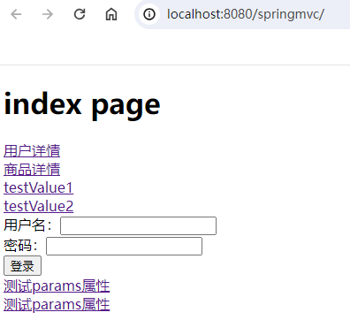
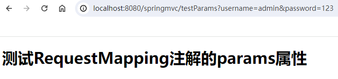


假如发送请求时，没有传递username参数会怎样？
```html
<a th:href="@{/testParams(password='123')}">测试params属性</a><br>
```
启动服务器，测试：
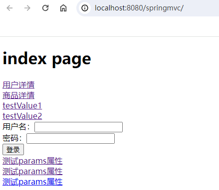
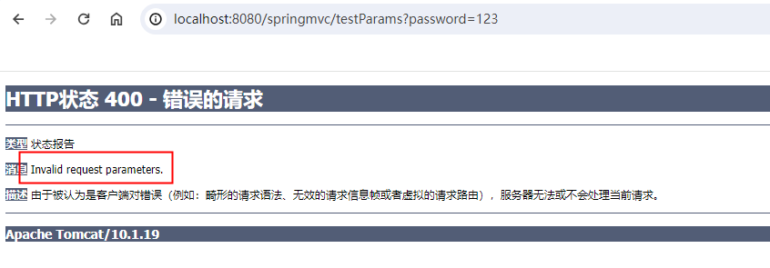
提示无效的请求参数，服务器无法或不会处理当前请求。
params属性剩下的三种情况，自行测试！！！！


# RequestMapping注解的headers属性
## 认识headers属性
headers和params原理相同，用法也相同。
当前端提交的请求头信息和后端要求的请求头信息一致时，才能映射成功。
请求头信息怎么查看？在chrome浏览器中，F12打开控制台，找到Network，可以查看具体的请求协议和响应协议。在请求协议中可以看到请求头信息，例如：
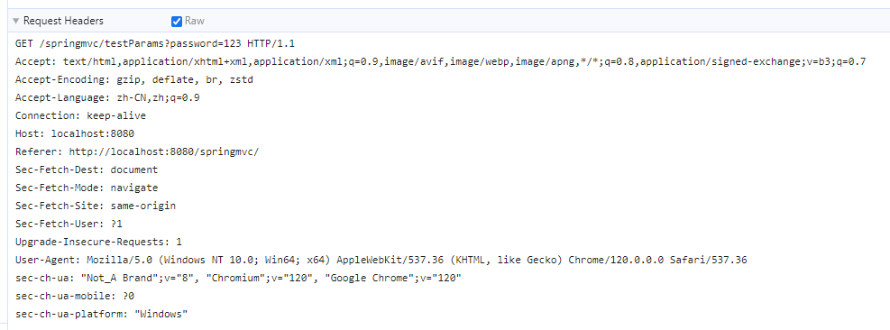
请求头信息和请求参数信息一样，都是键值对形式，例如上图中：

- Referer: http://localhost:8080/springmvc/     键是Referer，值是http://localhost:8080/springmvc/
- Host: localhost:8080     键是Host，值是localhost:8080


## headers属性的4种用法
@RequestMapping(value="/login", headers={**"Referer"**, "Host"}) 表示：请求头信息中必须包含Referer和Host，才能与当前标注的方法进行映射。
@RequestMapping(value="/login", headers={**"Referer"**, "!Host"}) 表示：请求头信息中必须包含Referer，但不包含Host，才能与当前标注的方法进行映射。
@RequestMapping(value="/login", headers={**"Referer=http://localhost:8080/springmvc/"**, "Host"}) 表示：请求头信息中必须包含Referer和Host，并且Referer的值必须是http://localhost:8080/springmvc/，才能与当前标注的方法进行映射。
@RequestMapping(value="/login", headers={**"Referer!=http://localhost:8080/springmvc/"**, "Host"}) 表示：请求头信息中必须包含Referer和Host，并且Referer的值不是http://localhost:8080/springmvc/，才能与当前标注的方法进行映射。

注意：如果前端提交的请求头信息，和后端要求的请求头信息不一致，则出现404错误！！！


## 测试headers属性
在 RequestMappingTestController 类中添加以下方法：
```java
@RequestMapping(value="/testHeaders", headers = {"Referer=http://localhost:8080/springmvc/"})
public String testHeaders(){
    return "testHeaders";
}
```
提供视图页面：
```html
<!DOCTYPE html>
<html lang="en" xmlns:th="http://www.thymeleaf.org">
<head>
    <meta charset="UTF-8">
    <title>test Headers</title>
</head>
<body>
<h1>测试RequestMapping注解的headers属性</h1>
</body>
</html>
```
在index.html页面中添加超链接：
```html
<!--测试RequestMapping的headers属性-->
<a th:href="@{/testHeaders}">测试headers属性</a><br>
```

启动服务器，测试结果：
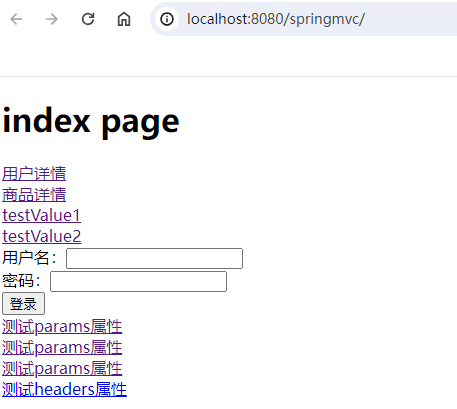
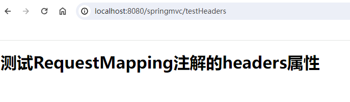
将后端控制器中的headers属性值进行修改：
```java
@RequestMapping(value="/testHeaders", headers = {"Referer=http://localhost:8888/springmvc/"})
public String testHeaders(){
    return "testHeaders";
}
```
再次测试：
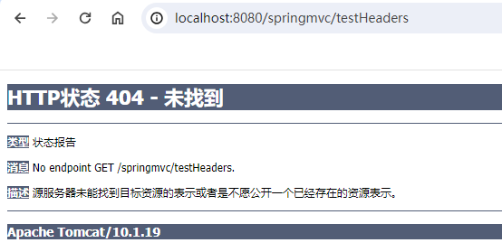
其他情况自行测试！！！！


