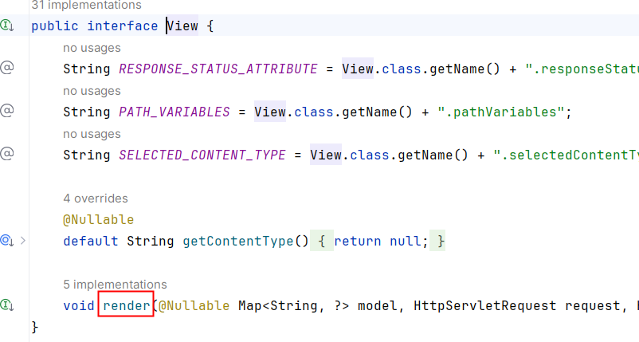
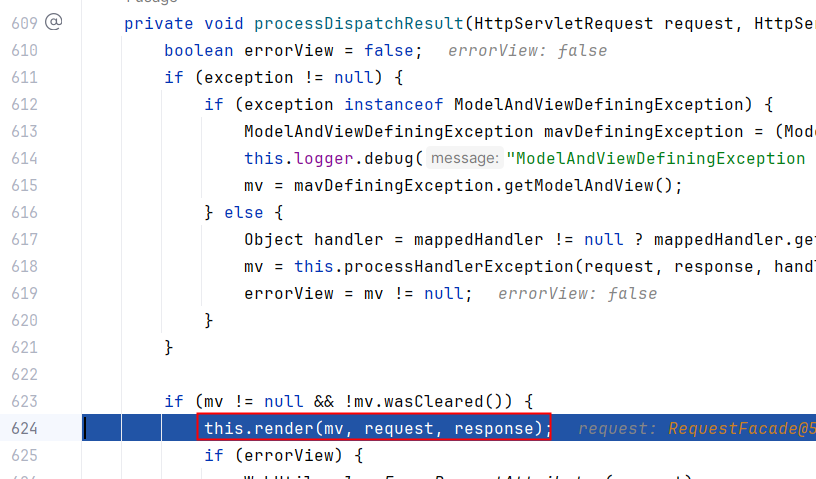
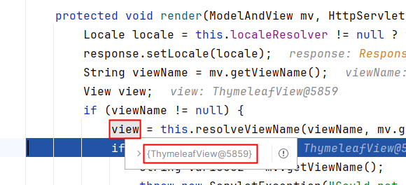
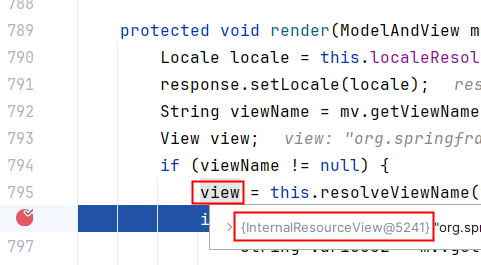
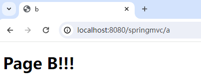

# SpringMVC中视图的实现原理
## Spring MVC视图支持可配置
在Spring MVC中，视图View是支持定制的，例如我们之前在 springmvc.xml 文件中进行了如下的配置：
```xml
<!--视图解析器-->
<bean id="thymeleafViewResolver" class="org.thymeleaf.spring6.view.ThymeleafViewResolver">
    <!--作用于视图渲染的过程中，可以设置视图渲染后输出时采用的编码字符集-->
    <property name="characterEncoding" value="UTF-8"/>
    <!--如果配置多个视图解析器，它来决定优先使用哪个视图解析器，它的值越小优先级越高-->
    <property name="order" value="1"/>
    <!--当 ThymeleafViewResolver 渲染模板时，会使用该模板引擎来解析、编译和渲染模板-->
    <property name="templateEngine">
        <bean class="org.thymeleaf.spring6.SpringTemplateEngine">
            <!--用于指定 Thymeleaf 模板引擎使用的模板解析器。模板解析器负责根据模板位置、模板资源名称、文件编码等信息，加载模板并对其进行解析-->
            <property name="templateResolver">
                <bean class="org.thymeleaf.spring6.templateresolver.SpringResourceTemplateResolver">
                    <!--设置模板文件的位置（前缀）-->
                    <property name="prefix" value="/WEB-INF/templates/"/>
                    <!--设置模板文件后缀（后缀），Thymeleaf文件扩展名不一定是html，也可以是其他，例如txt，大部分都是html-->
                    <property name="suffix" value=".html"/>
                    <!--设置模板类型，例如：HTML,TEXT,JAVASCRIPT,CSS等-->
                    <property name="templateMode" value="HTML"/>
                    <!--用于模板文件在读取和解析过程中采用的编码字符集-->
                    <property name="characterEncoding" value="UTF-8"/>
                </bean>
            </property>
        </bean>
    </property>
</bean>
```
以上的配置表明当前SpringMVC框架使用的视图View是Thymeleaf的。
如果你需要换成其他的视图View，修改以上的配置即可。这样就可以非常轻松的完成视图View的扩展。
这种设计是完全符合OCP开闭原则的。视图View和框架是解耦合的，耦合度低扩展能力强。视图View可以通过配置文件进行灵活切换。


## Spring MVC支持的常见视图
Spring MVC支持的常见视图包括：

1. InternalResourceView：内部资源视图（Spring MVC框架内置的，专门为`JSP模板语法`准备的）
2. RedirectView：重定向视图（Spring MVC框架内置的，用来完成重定向效果）
3. ThymeleafView：Thymeleaf视图（第三方的，为`Thymeleaf模板语法`准备的）
4. FreeMarkerView：FreeMarker视图（第三方的，为`FreeMarker模板语法`准备的）
5. VelocityView：Velocity视图（第三方的，为`Velocity模板语法`准备的）
6. PDFView：PDF视图（第三方的，专门用来生成pdf文件视图）
7. ExcelView：Excel视图（第三方的，专门用来生成excel文件视图）
8. ......


## 实现视图机制的核心接口
实现视图的核心类与接口包括：

1. DispatcherServlet类（前端控制器）：
   1. 职责：在整个Spring MVC执行流程中，负责中央调度。
   2. 核心方法：doDispatch


2. ViewResolver接口（视图解析器）：
   1. 职责：负责将`逻辑视图名`转换为`物理视图名`，最终创建View接口的实现类，即视图实现类对象。
   2. 核心方法：resolveViewName


3. View接口（视图）:
   1. 职责：负责将模型数据Model渲染为视图格式（HTML代码），并最终将生成的视图（HTML代码）输出到客户端。（它负责将模板语言转换成HTML代码）
   2. 核心方法：render



4. ViewResolverRegistry（视图解析器注册器）：
   1. 负责在web容器（Tomcat）启动的时候，完成视图解析器的注册。如果有多个视图解析器，会将视图解析器对象按照order的配置放入List集合。

**总结：**

- **实现视图的核心类和接口包括：ViewResolverRegistry、DispatcherServlet、ViewResolver、View**
- **如果你想定制自己的视图组件：**
   - **编写类实现ViewResolver接口，实现resolveViewName方法，在该方法中完成**`**逻辑视图名**`**转换为**`**物理视图名**`**，并返回View对象。**
   - **编写类实现View接口，实现render方法，在该方法中将模板语言转换成HTML代码，并将HTML代码响应到浏览器。**
- **如果Spring MVC框架中使用Thymeleaf作为视图技术。那么相关的类包括：**
   - **ThymeleafView**
   - **ThymeleafViewResolver**


## 实现视图机制的原理描述
假设我们SpringMVC中使用了Thymeleaf作为视图。
第一步：浏览器发送请求给web服务器
第二步：Spring MVC中的DispatcherServlet接收到请求
第三步：DispatcherServlet根据请求路径分发到对应的Controller
第四步：DispatcherServlet调用Controller的方法
第五步：Controller的方法处理业务并返回一个`逻辑视图名`给DispatcherServlet
第六步：DispatcherServlet调用ThymeleafViewResolver的resolveViewName方法，将`逻辑视图名`转换为`物理视图名`，并创建ThymeleafView对象返回给DispatcherServlet
第七步：DispatcherServlet再调用ThymeleafView的render方法，render方法将模板语言转换为HTML代码，响应给浏览器，完成最终的渲染。


假设我们SpringMVC中使用了JSP作为视图。
第一步：浏览器发送请求给web服务器
第二步：Spring MVC中的DispatcherServlet接收到请求
第三步：DispatcherServlet根据请求路径分发到对应的Controller
第四步：DispatcherServlet调用Controller的方法
第五步：Controller的方法处理业务并返回一个`逻辑视图名`给DispatcherServlet
第六步：DispatcherServlet调用`InternalResourceViewResolver`的`resolveViewName`方法，将`逻辑视图名`转换为`物理视图名`，并创建`InternalResourceView`对象返回给DispatcherServlet
第七步：DispatcherServlet再调用`InternalResourceView`的`render`方法，render方法将模板语言转换为HTML代码，响应给浏览器，完成最终的渲染。


## 逻辑视图名到物理视图名的转换
逻辑视图名最终转换的物理视图名是什么，取决再springmvc.xml文件中视图解析器的配置：
假如视图解析器配置的是ThymeleafViewResolver，如下：
```xml
<bean id="thymeleafViewResolver" class="org.thymeleaf.spring6.view.ThymeleafViewResolver">
    <property name="characterEncoding" value="UTF-8"/>
    <property name="order" value="1"/>
    <property name="templateEngine">
        <bean class="org.thymeleaf.spring6.SpringTemplateEngine">
            <property name="templateResolver">
                <bean class="org.thymeleaf.spring6.templateresolver.SpringResourceTemplateResolver">
                    <property name="prefix" value="/WEB-INF/templates/"/>
                    <property name="suffix" value=".html"/>
                    <property name="templateMode" value="HTML"/>
                    <property name="characterEncoding" value="UTF-8"/>
                </bean>
            </property>
        </bean>
    </property>
</bean>
```
以下程序返回逻辑视图名：index
```java
@RequestMapping("/index")
public String toIndex(){
    return "index";
}
```
最终逻辑视图名"index" 转换为物理视图名：/WEB-INF/templates/index.html

假如视图解析器配置的是InternalResourceViewResolver，如下：
```xml
<bean id="viewResolver" class="org.springframework.web.servlet.view.InternalResourceViewResolver">
  <property name="prefix" value="/WEB-INF/templates/"/>
  <property name="suffix" value=".jsp"/>
</bean>
```
以下程序返回逻辑视图名：index
```java
@RequestMapping("/index")
public String toIndex(){
    return "index";
}
```
最终逻辑视图名"index" 转换为物理视图名：/WEB-INF/templates/index.jsp


# Thymeleaf视图
我们在学习前面内容的时候，采用的都是Thymeleaf视图。我们再来测试一下，看看底层创建的视图对象是不是`ThymeleafView`
springmvc.xml配置内容如下：
```xml
<?xml version="1.0" encoding="UTF-8"?>
<beans xmlns="http://www.springframework.org/schema/beans"
       xmlns:xsi="http://www.w3.org/2001/XMLSchema-instance"
       xmlns:context="http://www.springframework.org/schema/context"
       xsi:schemaLocation="http://www.springframework.org/schema/beans http://www.springframework.org/schema/beans/spring-beans.xsd http://www.springframework.org/schema/context https://www.springframework.org/schema/context/spring-context.xsd">

    <!--组件扫描-->
    <context:component-scan base-package="com.powernode.springmvc.controller"/>

    <!--视图解析器-->
    <bean id="thymeleafViewResolver" class="org.thymeleaf.spring6.view.ThymeleafViewResolver">
        <property name="characterEncoding" value="UTF-8"/>
        <property name="order" value="1"/>
        <property name="templateEngine">
            <bean class="org.thymeleaf.spring6.SpringTemplateEngine">
                <property name="templateResolver">
                    <bean class="org.thymeleaf.spring6.templateresolver.SpringResourceTemplateResolver">
                        <property name="prefix" value="/WEB-INF/thymeleaf/"/>
                        <property name="suffix" value=".html"/>
                        <property name="templateMode" value="HTML"/>
                        <property name="characterEncoding" value="UTF-8"/>
                    </bean>
                </property>
            </bean>
        </property>
    </bean>
</beans>
```
Controller代码如下：
```java
package com.powernode.springmvc.controller;

import org.springframework.stereotype.Controller;
import org.springframework.web.bind.annotation.RequestMapping;

@Controller
public class IndexController {
    @RequestMapping("/index")
    public String toIndex(){
        return "index";
    }
}

```
视图页面：
```html
<!DOCTYPE html>
<html lang="en" xmlns:th="http://www.thymeleaf.org">
<head>
    <meta charset="UTF-8">
    <title>index page</title>
</head>
<body>
<h1>index page</h1>
</body>
</html>
```


添加断点：在DispatcherServlet的doDispatch方法的下图位置添加断点


启动Tomcat，在浏览器地址栏上发送请求：http://localhost:8080/springmvc/index

程序走到以上位置，这行代码是调用对应的Controller，并且Controller最终会返回ModelAndView对象：mv
按照我们之前所讲，返回mv之后，接下来就是视图处理与渲染，接着往下走，走到下图这一行：

这个方法的作用是处理分发结果，就是在这个方法当中进行了视图的处理与渲染，进入该方法：

进去之后走到上图位置：这个方法就是用来渲染页面的方法，再进入该方法：

走到上图位置就可以看到底层创建的是ThymeleafView对象。


# JSP视图（了解）
我们再来跟一下源码，看看JSP视图底层创建的是不是InternalResourceView对象。
我们前面说过 InternalResourceView是SpringMVC框架内置的，翻译为内部资源视图，SpringMVC把JSP看做是内部资源。可见JSP在之前的技术栈中有很高的地位。
不过，当下流行的开发中JSP使用较少，这里不再详细讲解。只是测试一下。
springmvc.xml配置如下：
```xml
<?xml version="1.0" encoding="UTF-8"?>
<beans xmlns="http://www.springframework.org/schema/beans"
       xmlns:xsi="http://www.w3.org/2001/XMLSchema-instance"
       xmlns:context="http://www.springframework.org/schema/context"
       xsi:schemaLocation="http://www.springframework.org/schema/beans http://www.springframework.org/schema/beans/spring-beans.xsd http://www.springframework.org/schema/context https://www.springframework.org/schema/context/spring-context.xsd">

    <!--组件扫描-->
    <context:component-scan base-package="com.powernode.springmvc.controller"/>

    <!--视图解析器-->
    <bean id="viewResolver" class="org.springframework.web.servlet.view.InternalResourceViewResolver">
        <property name="prefix" value="/WEB-INF/jsp/"/>
        <property name="suffix" value=".jsp"/>
    </bean>
</beans>
```
Controller代码如下：
```java
package com.powernode.springmvc.controller;

import org.springframework.stereotype.Controller;
import org.springframework.web.bind.annotation.RequestMapping;

@Controller
public class IndexController {
    @RequestMapping("/index")
    public String toIndex(){
        return "index";
    }
}
```
视图页面：
```html
<%@ page contentType="text/html;charset=UTF-8" language="java" %>
<html>
  <head>
    <title>index jsp</title>
  </head>
  <body>
    <h1>index jsp!</h1>
  </body>
</html>
```

启动web容器，添加断点跟踪：

通过测试得知：对于JSP视图来说，底层创建的视图对象是InternalResourceView。


# 转发与重定向
## 回顾转发和重定向区别

1. 转发是一次请求。因此浏览器地址栏上的地址不会发生变化。
2. 重定向是两次请求。因此浏览器地址栏上的地址会发生变化。
3. 转发的代码实现：request.getRequestDispatcher("/index").forward(request, response);
4. 重定向的代码实现：response.sendRedirect("/webapproot/index");
5. 转发是服务器内部资源跳转，由服务器来控制。不可实现跨域访问。
6. 重定向可以完成内部资源的跳转，也可以完成跨域跳转。
7. 转发的方式可以访问WEB-INF目录下受保护的资源。
8. 重定向相当于浏览器重新发送了一次请求，在浏览器直接发送的请求是无法访问WEB-INF目录下受保护的资源的。
9. 转发原理：
   1. 假设发送了 /a 请求，执行了 AServlet
   2. 在AServlet 中通过`request.getRequestDispatcher("/b").forward(request,response);`转发到BServlet
   3. 从AServlet跳转到BServlet是服务器内部来控制的。对于浏览器而言，浏览器只发送了一个 /a 请求。
10. 重定向原理：
   1. 假设发送了 /a 请求，执行了 AServlet
   2. 在AServlet 中通过`response.sendRedirect("/webapproot/b")`重定向到BServlet
   3. 此时服务器会将请求路径`/webapproot/b`响应给浏览器
   4. 浏览器会自发的再次发送`/webapproot/b`请求来访问BServlet
   5. 因此对于重定向来说，发送了两次请求，一次是 `/webapproot/a`，另一次是`/webapproot/b`。

以上所描述的是使用原生Servlet API来完成转发和重定向。在Spring MVC中是如何转发和重定向的呢？


## forward
在Spring MVC中默认就是转发的方式，我们之前所写的程序，都是转发的方式。只不过都是转发到Thymeleaf的模板文件xxx.html上。
那么，在Spring MVC中如何转发到另一个Controller上呢？可以使用Spring MVC的`forward`
代码实现如下：
```java
package com.powernode.springmvc.controller;

import org.springframework.stereotype.Controller;
import org.springframework.web.bind.annotation.RequestMapping;

@Controller
public class IndexController {

    @RequestMapping("/a")
    public String toA(){
        return "forward:/b";
    }

    @RequestMapping("/b")
    public String toB(){
        return "b";
    }
}
```
视图页面：
```html
<!DOCTYPE html>
<html lang="en" xmlns:th="http://www.thymeleaf.org">
<head>
    <meta charset="UTF-8">
    <title>b</title>
</head>
<body>
<h1>Page B!!!</h1>
</body>
</html>
```
启动服务器，浏览器地址栏上输入：http://localhost:8080/springmvc/a

通过测试，可以顺利的完成转发，转发是一次请求，可以看到地址栏上的地址没有发生改变。

我们来跟踪一下源码，看看以上程序执行过程中，创建了几个视图对象，分别是什么？


通过源码的跟踪得知：整个请求处理过程中，一共创建了两个视图对象

- InternalResourceView
- ThymeleafView

这说明转发底层创建的视图对象是：InternalResourceView。
**思考：既然会创建InternalResourceView，应该会对应一个视图解析器呀（InternalResourceViewResolver）？但是我在springmvc.xml文件中只配置了ThymeleafViewResolver，并没有配置InternalResourceViewResolver呀？这是为什么？**
**这是因为**`**forward:**`** 后面的不是**`**逻辑视图名**`**，而是一个**`**请求路径**`**。因此转发是不需要视图解析器的。**
**另外，转发使用的是InternalResourceView，也说明了转发是内部资源的跳转。（Internal是内部的意思，Resource是资源的意思。）**


## redirect
redirect是专门完成重定向效果的。和forward语法类似，只需要将之前的 `return "forward:/b"`修改为 `return "redirect:/b"`即可。
```java
package com.powernode.springmvc.controller;

import org.springframework.stereotype.Controller;
import org.springframework.web.bind.annotation.RequestMapping;

@Controller
public class IndexController {

    @RequestMapping("/a")
    public String toA(){
        return "redirect:/b";
    }

    @RequestMapping("/b")
    public String toB(){
        return "b";
    }
}

```
视图页面：
```html
<!DOCTYPE html>
<html lang="en" xmlns:th="http://www.thymeleaf.org">
<head>
    <meta charset="UTF-8">
    <title>b</title>
</head>
<body>
<h1>Page B!!!</h1>
</body>
</html>
```
启动服务器，浏览器地址栏上输入：http://localhost:8080/springmvc/a

可见，重定向是两次请求，地址栏上的地址发生了改变。

可以看一下源码，在重定向的时候，Spring MVC创建哪个视图对象？


通过断点调试可以看出，当重定向的时候，SpringMVC会创建一个重定向视图对象：**RedirectView**。这个视图对象也是SpringMVC框架内置的。
另外可以看出重定向之后的第二次请求创建的视图对象就是ThymeleafView了。


注意：从springmvc应用重定向到springmvc2应用（跨域），语法是：
```java
@RequestMapping("/a")
public String a(){
    return "redirect:http://localhost:8080/springmvc2/b";
}
```
可以自行测试一下！！！


# <mvc:view-controller>
`<mvc:view-controller>` 配置用于将某个请求映射到特定的视图上，即指定某一个 URL 请求到一个视图资源的映射，使得这个视图资源可以被访问。它相当于是一个独立的处理程序，不需要编写任何 Controller，只需要指定 URL 和对应的视图名称就可以了。
一般情况下，`<mvc:view-controller>` 配置可以替代一些没有业务逻辑的 Controller，例如首页、错误页面等。当用户访问配置的 URL 时，框架将直接匹配到对应的视图，而无需再经过其他控制器的处理。
`<mvc:view-controller>` 配置的格式如下： 
```xml
<mvc:view-controller path="/如何访问该页面" view-name="对应的逻辑视图名称" />
```
其中：

- `path`：被映射的 URL 路径。
- `view-name`：对应的逻辑视图名称。

例如，配置首页的映射：
```xml
<mvc:view-controller path="/" view-name="index" />
```
上述配置将会匹配上访问应用程序的根路径，如：http://localhost:8080/。当用户在浏览器中访问该根路径时，就会直接渲染名为 `index` 的视图。


# <mvc:annotation-driven/>
在SpringMVC中，如果在springmvc.xml文件中配置了 `<mvc:view-controller>`，就需要同时在springmvc.xml文件中添加如下配置：
```xml
<mvc:annotation-driven/>
```
该配置的作用是：启用Spring MVC的注解。
如果没有以上的配置，Controller就无法访问到。访问之前的Controller会发生 404 问题。


# 访问静态资源
一个项目可能会包含大量的静态资源，比如：css、js、images等。
由于我们DispatcherServlet的url-pattern配置的是“/”，之前我们说过，这个"/"代表的是除jsp请求之外的所有请求，也就是说访问应用中的静态资源，也会走DispatcherServlet，这会导致404错误，无法访问静态资源，如何解决，两种方案：

- 使用默认 Servlet 处理静态资源
- 使用 `mvc:resources` 标签配置静态资源处理

这两种方式都可以。自行选择。


## 使用默认Servlet处理静态资源
首先需要在springmvc.xml文件中添加以下配置，开启 `默认Servlet处理静态资源` 功能：
```xml
<!-- 开启注解驱动 -->
<mvc:annotation-driven />

<!--开启默认Servlet处理-->
<mvc:default-servlet-handler>
```
然后在web.xml文件中指定什么样的路径走其他Servlet：
```xml
<servlet>
    <servlet-name>default</servlet-name>
    <servlet-class>org.apache.catalina.servlets.DefaultServlet</servlet-class>
    <init-param>
        <param-name>debug</param-name>
        <param-value>0</param-value>
    </init-param>
    <init-param>
        <param-name>listings</param-name>
        <param-value>false</param-value>
    </init-param>
    <load-on-startup>1</load-on-startup>
</servlet>
<servlet-mapping>
    <servlet-name>default</servlet-name>
    <url-pattern>/</url-pattern>
</servlet-mapping>
```
以上配置url-pattern使用的也是"/"，和DispatcherServlet一样。表示的含义是：**同一个请求路径，先走DispatcherServlet，如果找不到则走默认的Servlet。**
默认的 Servlet 类中的代码已经由 Tomcat 服务器提供了实现，一般不需要开发者自己编写。在上面的示例中，我们指定了 `org.apache.catalina.servlets.DefaultServlet`，则 Tomcat 服务器会自动将请求转发给该类处理。在处理时，该类会根据请求的 URL 去查询 Web 应用的静态资源（如 HTML、CSS、JavaScript 和图片等），并将其返回给用户。
告诉大家一个好消息，以上在web.xml文件中的配置我们也可以省略了，因为在Tomcat服务器中已经为我们提前配置好了，在CATALINA_HOME/conf/web.xml文件中，如下：


因此我们只需要在springmvc.xml文件中启用这个默认的Servlet即可：`<mvc:default-servlet-handler>`


## 使用 mvc:resources 标签配置静态资源
访问静态资源，也可以在springmvc.xml文件中添加如下的配置：
```xml
<!-- 开启注解驱动 -->
<mvc:annotation-driven />

<!-- 配置静态资源处理 -->
<mvc:resources mapping="/static/**" location="/static/" />
```
表示凡是请求路径是"/static/"开始的，都会去"/static/"目录下找该资源。
注意：要想使用 `<mvc:resources>` 配置，必须开启注解驱动 `<mvc:annotation-driven />`
