# RESTFul编程风格
## RESTFul是什么
RESTFul是`WEB服务接口`的一种设计风格。
RESTFul定义了一组约束条件和规范，可以让`WEB服务接口`更加简洁、易于理解、易于扩展、安全可靠。

RESTFul对一个`WEB服务接口`都规定了哪些东西？

- 对请求的URL格式有约束和规范
- 对HTTP的请求方式有约束和规范
- 对请求和响应的数据格式有约束和规范
- 对HTTP状态码有约束和规范
- 等 ......

REST对请求方式的约束是这样的：

- 查询必须发送GET请求
- 新增必须发送POST请求
- 修改必须发送PUT请求
- 删除必须发送DELETE请求

REST对URL的约束是这样的：

- 传统的URL：get请求，/springmvc/getUserById?id=1
- REST风格的URL：get请求，/springmvc/user/1

- 传统的URL：get请求，/springmvc/deleteUserById?id=1
- REST风格的URL：delete请求, /springmvc/user/1


RESTFul对URL的约束和规范的核心是：**通过采用**`**不同的请求方式**`**+ **`**URL**`**来确定WEB服务中的资源。**

**RESTful 的英文全称是 Representational State Transfer（表述性状态转移）。简称REST。**
表述性（Representational）是：URI + 请求方式。
状态（State）是：服务器端的数据。
转移（Transfer）是：变化。
表述性状态转移是指：通过 URI + 请求方式 来控制服务器端数据的变化。


## RESTFul风格与传统方式对比
传统的 URL 与 RESTful URL 的区别是传统的 URL 是基于方法名进行资源访问和操作，而 RESTful URL 是基于资源的结构和状态进行操作的。下面是一张表格，展示两者之间的具体区别：

| **传统的 URL** | **RESTful URL** |
| --- | --- |
| GET /getUserById?id=1 | GET /user/1 |
| GET /getAllUser | GET /user |
| POST /addUser | POST /user |
| POST /modifyUser | PUT /user |
| GET /deleteUserById?id=1 | DELETE /user/1 |

从上表中我们可以看出，传统的URL是基于动作的，而 RESTful URL 是基于资源和状态的，因此 RESTful URL 更加清晰和易于理解，这也是 REST 架构风格被广泛使用的主要原因之一。


## RESTFul方式演示查询
RESTFul规范中规定，如果要查询数据，需要发送GET请求。
### 根据id查询(GET /api/user/1)
```xml
<?xml version="1.0" encoding="UTF-8"?>
<beans xmlns="http://www.springframework.org/schema/beans"
       xmlns:xsi="http://www.w3.org/2001/XMLSchema-instance"
       xmlns:context="http://www.springframework.org/schema/context"
       xmlns:mvc="http://www.springframework.org/schema/mvc"
       xsi:schemaLocation="http://www.springframework.org/schema/beans http://www.springframework.org/schema/beans/spring-beans.xsd http://www.springframework.org/schema/context https://www.springframework.org/schema/context/spring-context.xsd http://www.springframework.org/schema/mvc https://www.springframework.org/schema/mvc/spring-mvc.xsd">

    <!--组件扫描-->
    <context:component-scan base-package="com.powernode.springmvc.controller"/>

    <!--视图解析器-->
    <bean id="thymeleafViewResolver" class="org.thymeleaf.spring6.view.ThymeleafViewResolver">
        <property name="characterEncoding" value="UTF-8"/>
        <property name="order" value="1"/>
        <property name="templateEngine">
            <bean class="org.thymeleaf.spring6.SpringTemplateEngine">
                <property name="templateResolver">
                    <bean class="org.thymeleaf.spring6.templateresolver.SpringResourceTemplateResolver">
                        <property name="prefix" value="/WEB-INF/thymeleaf/"/>
                        <property name="suffix" value=".html"/>
                        <property name="templateMode" value="HTML"/>
                        <property name="characterEncoding" value="UTF-8"/>
                    </bean>
                </property>
            </bean>
        </property>
    </bean>

    <!--启用注解-->
    <mvc:annotation-driven/>

    <!--视图控制器映射-->
    <mvc:view-controller path="/" view-name="index"/>
</beans>
```


首页index.html
```html
<!DOCTYPE html>
<html lang="en" xmlns:th="http://www.thymeleaf.org">
<head>
    <meta charset="UTF-8">
    <title>index</title>
</head>
<body>
<h1>index page</h1>
<hr>
<!--根据id查询：GET /api/user/1 -->
<a th:href="@{/api/user/1}">根据id查询用户信息</a><br>

</body>
</html>
```

控制器Controller：
```java
package com.powernode.springmvc.controller;

import org.springframework.stereotype.Controller;
import org.springframework.web.bind.annotation.PathVariable;
import org.springframework.web.bind.annotation.RequestMapping;
import org.springframework.web.bind.annotation.RequestMethod;

@Controller
public class UserController {

    @RequestMapping(value = "/api/user/{id}", method = RequestMethod.GET)
    public String getById(@PathVariable("id") Integer id){
        System.out.println("根据用户id查询用户信息，用户id是" + id);
        return "ok";
    }

}

```


视图页面：
```html
<!DOCTYPE html>
<html lang="en" xmlns:th="http://www.thymeleaf.org">
<head>
    <meta charset="UTF-8">
    <title>ok</title>
</head>
<body>
<h1>ok</h1>
</body>
</html>
```

启动服务器，测试：http://localhost:8080/springmvc
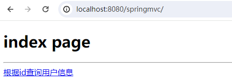
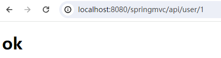
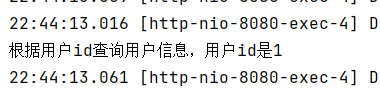


### 查询所有(GET /api/user)
```html
<!--查询所有-->
<a th:href="@{/api/user}">查询所有</a><br>
```
```java
@RequestMapping(value = "/api/user", method = RequestMethod.GET)
public String getAll(){
    System.out.println("查询所有用户信息");
    return "ok";
}
```
启动服务器测试：
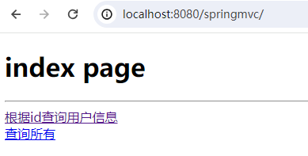

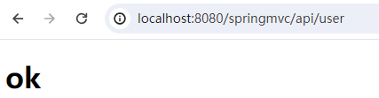

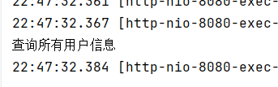


## RESTFul方式演示增加(POST /api/user)
RESTFul规范中规定，如果要进行保存操作，需要发送POST请求。
```html
<!--保存用户-->
<form th:action="@{/api/user}" method="post">
    <input type="submit" th:value="保存">
</form>
```

```java
@RequestMapping(value = "/api/user", method = RequestMethod.POST)
public String save(){
    System.out.println("保存用户信息");
    return "ok";
}
```

启动服务器测试：
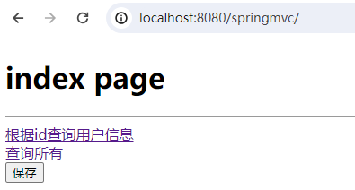
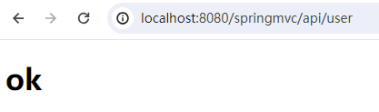
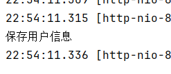


## RESTFul方式演示修改
RESTFul规范中规定，如果要进行保存操作，需要发送PUT请求。
**如何发送PUT请求？**
**第一步：首先你必须是一个POST请求。**
**第二步：在发送POST请求的时候，提交这样的数据：**`**_method=PUT**`
**第三步：在web.xml文件配置SpringMVC提供的过滤器：HiddenHttpMethodFilter**

实践一下：
```html
<!--修改用户-->
<hr>
<form th:action="@{/api/user}" method="post">
    <!--隐藏域的方式提交 _method=put -->
    <input type="hidden" name="_method" value="put">
    用户名：<input type="text" name="username"><br>
    <input type="submit" th:value="修改">
</form>
```
```xml
<!--隐藏的HTTP请求方式过滤器-->
<filter>
    <filter-name>hiddenHttpMethodFilter</filter-name>
    <filter-class>org.springframework.web.filter.HiddenHttpMethodFilter</filter-class>
</filter>
<filter-mapping>
    <filter-name>hiddenHttpMethodFilter</filter-name>
    <url-pattern>/*</url-pattern>
</filter-mapping>
```
```java
@RequestMapping(value = "/api/user", method = RequestMethod.PUT)
public String update(String username){
    System.out.println("修改用户信息，用户名：" + username);
    return "ok";
}
```


注意pom.xml文件中添加如下配置：
```xml
<build>
    <plugins>
        <plugin>
            <groupId>org.apache.maven.plugins</groupId>
            <artifactId>maven-compiler-plugin</artifactId>
            <version>3.12.1</version>
            <configuration>
                <source>21</source>
                <target>21</target>
                <compilerArgs>
                    <arg>-parameters</arg>
                </compilerArgs>
            </configuration>
        </plugin>
    </plugins>
</build>
```
**一定要重新build一下：**
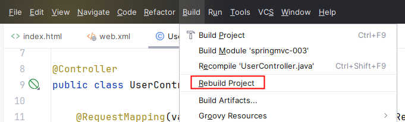

测试结果：
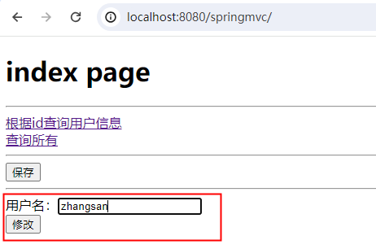
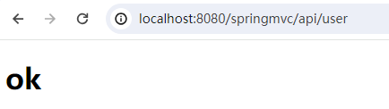
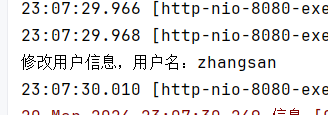


## HiddenHttpMethodFilter
HiddenHttpMethodFilter是Spring MVC框架提供的，专门用于RESTFul编程风格。
实现原理可以通过源码查看：
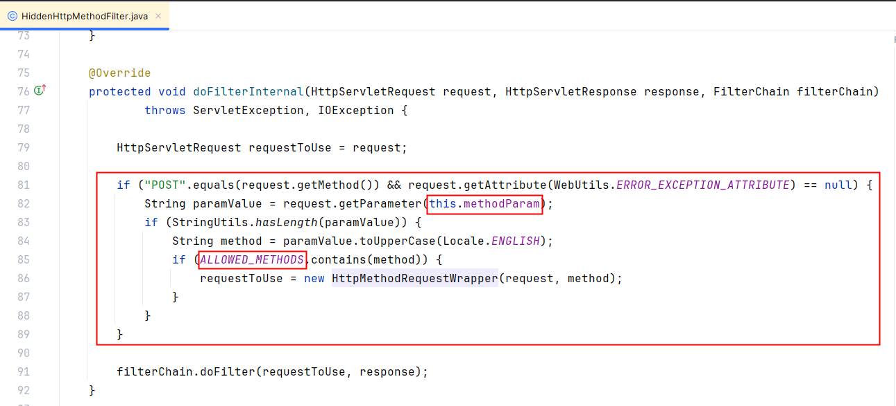
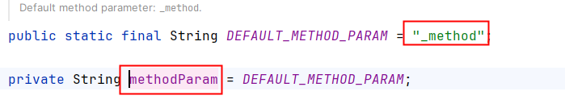
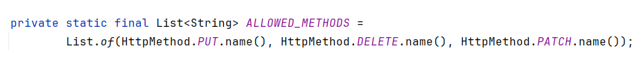
通过源码可以看到，if语句中，首先判断是否为POST请求，如果是POST请求，调用`request.getParameter(this.methodParam)`。可以看到`this.methodParam`是`_method`，这样就要求我们在提交请求方式的时候必须采用这个格式：`_method=put`。获取到请求方式之后，调用了toUpperCase转换成大写了。因此前端页面中小写的put或者大写的PUT都是可以的。if语句中嵌套的if语句说的是，只有请求方式是 PUT,DELETE,PATCH的时候会创建HttpMethodRequestWrapper对象。而HttpMethodRequestWrapper对象的构造方法是这样的：
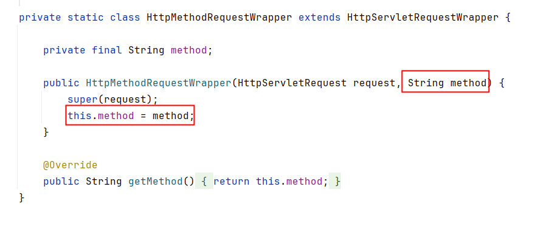
这样method就从POST变成了：PUT/DELETE/PATCH。


**重点注意事项：CharacterEncodingFilter和HiddenHttpMethodFilter的顺序**
细心的同学应该注意到了，在HiddenHttpMethodFilter源码中有这样一行代码：
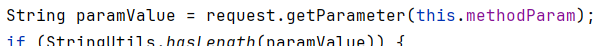
大家是否还记得，字符编码过滤器执行之前不能调用 request.getParameter方法，如果提前调用了，乱码问题就无法解决了。因为request.setCharacterEncoding()方法的执行必须在所有request.getParameter()方法之前执行。因此这两个过滤器就有先后顺序的要求，在web.xml文件中，应该先配置CharacterEncodingFilter，然后再配置HiddenHttpMethodFilter。


# 使用RESTFul实现用户管理系统
## 静态页面准备
文件包括：user.css、user_index.html、user_list.html、user_add.html、user_edit.html。代码如下：
### user.css
```css
.header {
  background-color: #f2f2f2;
  padding: 20px;
  text-align: center;
}

ul {
  list-style-type: none;
  margin: 0;
  padding: 0;
  overflow: hidden;
  background-color: #333;
}

li {
  float: left;
}

li a {
  display: block;
  color: white;
  text-align: center;
  padding: 14px 16px;
  text-decoration: none;
}

li a:hover:not(.active) {
  background-color: #111;
}

.active {
  background-color: #4CAF50;
}

form {
  width: 50%;
  margin: 0 auto;
  padding: 20px;
  border: 1px solid #ddd;
  border-radius: 4px;
}

label {
  display: block;
  margin-bottom: 8px;
}

input[type="text"], input[type="email"], select {
  width: 100%;
  padding: 6px 10px;
  margin: 8px 0;
  box-sizing: border-box;
  border: 1px solid #555;
  border-radius: 4px;
  font-size: 16px;
}

button[type="submit"] {
  padding: 10px;
  background-color: #4CAF50;
  color: #fff;
  border: none;
  border-radius: 4px;
  cursor: pointer;
}

button[type="submit"]:hover {
  background-color: #3e8e41;
}

table {
  border-collapse: collapse;
  width: 100%;
}

th, td {
  border: 1px solid #ddd;
  padding: 8px;
  text-align: left;
}

th {
  background-color: #f2f2f2;
}

tr:nth-child(even) {
  background-color: #f2f2f2;
}

.header {
  background-color: #f2f2f2;
  padding: 20px;
  text-align: center;
}

a {
  text-decoration: none;
  color: #333;
}

.add-button {
  margin-bottom: 20px;
  padding: 10px;
  background-color: #4CAF50;
  color: #fff;
  border: none;
  border-radius: 4px;
  cursor: pointer;
}

.add-button:hover {
  background-color: #3e8e41;
}
```


### user_index.html
```html
<!DOCTYPE html>
<html lang="en">
<head>
  <meta charset="UTF-8">
  <title>用户管理系统</title>
  <link rel="stylesheet" href="user.css" type="text/css"></link>
</head>
<body>
  <div class="header">
    <h1>用户管理系统</h1>
  </div>
  <ul>
    <li><a class="active" href="user_list.html">用户列表</a></li>
  </ul>
</body>
</html>
```
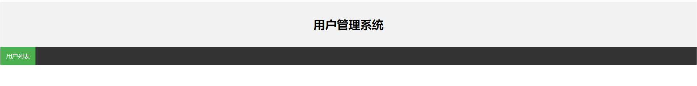


### user_list.html
```html
<!DOCTYPE html>
<html lang="en">
<head>
  <meta charset="UTF-8">
  <title>用户列表</title>
  <link rel="stylesheet" href="user.css" type="text/css"></link>
</head>
<body>
  <div class="header">
    <h1>用户列表</h1>
  </div>
  <div class="add-button-wrapper">
    <a class="add-button" href="user_add.html">新增用户</a>
  </div>
  <table>
    <thead>
      <tr>
        <th>编号</th>
        <th>用户名</th>
        <th>性别</th>
        <th>邮箱</th>
        <th>操作</th>
      </tr>
    </thead>
	<tbody>
      <tr>
        <td>1</td>
        <td>张三</td>
        <td>男</td>
        <td>zhangsan@powernode.com</td>
        <td>
          修改
          删除
        </td>
      </tr>
      <tr>
        <td>2</td>
        <td>李四</td>
        <td>女</td>
        <td>lisi@powernode.com</td>
        <td>
          修改
          删除
        </td>
      </tr>
    </tbody>
  </table>
</body>
</html>
```
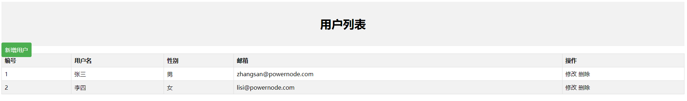


### user_add.html
```html
<!DOCTYPE html>
<html lang="en">
<head>
  <meta charset="UTF-8">
  <title>新增用户</title>
  <link rel="stylesheet" href="user.css" type="text/css"></link>
</head>
<body>
  <h1>新增用户</h1>
  <form>
    <label>用户名:</label>
    <input type="text" name="username" required>

    <label>性别:</label>
    <select name="gender" required>
      <option value="">-- 请选择 --</option>
      <option value="1">男</option>
      <option value="0">女</option>
    </select>

    <label>邮箱:</label>
    <input type="email" name="email" required>

	<button type="submit">保存</button>
  </form>
</body>
</html>
```
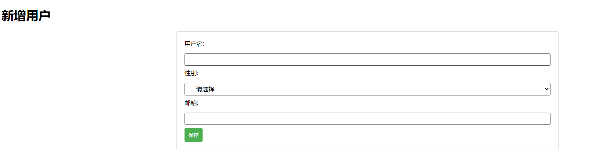


### user_edit.html
```html
<!DOCTYPE html>
<html lang="en">
<head>
  <meta charset="UTF-8">
  <title>修改用户</title>
  <link rel="stylesheet" href="user.css" type="text/css"></link>
</head>
<body>
  <h1>修改用户</h1>
  <form>
    <label>用户名:</label>
    <input type="text" name="username" value="张三" required>

    <label>性别:</label>
    <select name="gender" required>
      <option value="">-- 请选择 --</option>
      <option value="1" selected>男</option>
      <option value="0">女</option>
    </select>

    <label>邮箱:</label>
    <input type="email" name="email" value="zhangsan@powernode.com" required>

    <button type="submit">修改</button>
  </form>
</body>
</html>
```
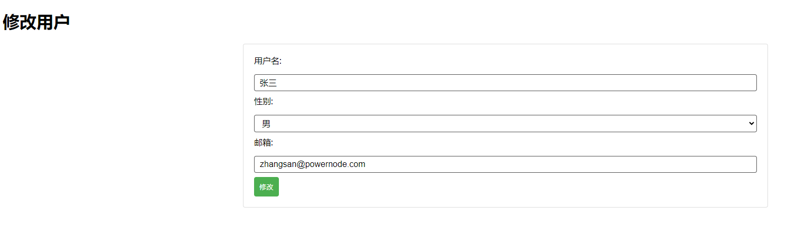


## SpringMVC环境搭建
### 创建module：usermgt
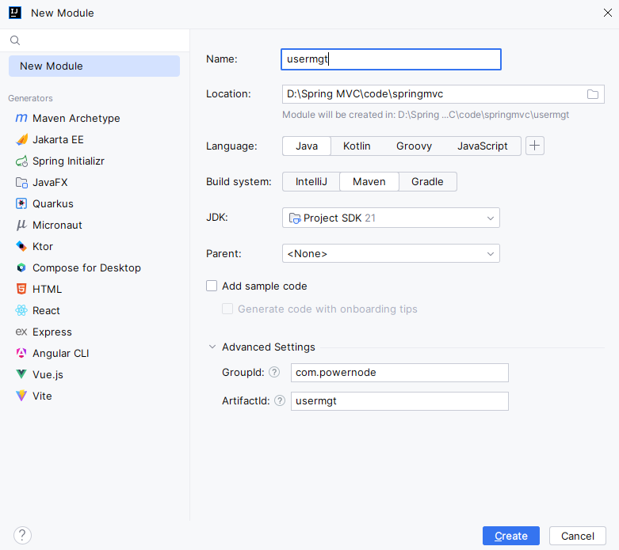
```xml
<?xml version="1.0" encoding="UTF-8"?>
<project xmlns="http://maven.apache.org/POM/4.0.0"
         xmlns:xsi="http://www.w3.org/2001/XMLSchema-instance"
         xsi:schemaLocation="http://maven.apache.org/POM/4.0.0 http://maven.apache.org/xsd/maven-4.0.0.xsd">
    <modelVersion>4.0.0</modelVersion>

    <groupId>com.powernode</groupId>
    <artifactId>usermgt</artifactId>
    <version>1.0-SNAPSHOT</version>
    <packaging>war</packaging>

    <dependencies>
        <!--springmvc-->
        <dependency>
            <groupId>org.springframework</groupId>
            <artifactId>spring-webmvc</artifactId>
            <version>6.1.5</version>
        </dependency>
        <!--servlet api-->
        <dependency>
            <groupId>jakarta.servlet</groupId>
            <artifactId>jakarta.servlet-api</artifactId>
            <version>6.0.0</version>
        </dependency>
        <!--logback-->
        <dependency>
            <groupId>ch.qos.logback</groupId>
            <artifactId>logback-classic</artifactId>
            <version>1.5.3</version>
        </dependency>
        <!--thymeleaf+spring6整合依赖-->
        <dependency>
            <groupId>org.thymeleaf</groupId>
            <artifactId>thymeleaf-spring6</artifactId>
            <version>3.1.2.RELEASE</version>
        </dependency>
    </dependencies>
    
    <properties>
        <maven.compiler.source>21</maven.compiler.source>
        <maven.compiler.target>21</maven.compiler.target>
        <project.build.sourceEncoding>UTF-8</project.build.sourceEncoding>
    </properties>

</project>
```


### 添加web支持
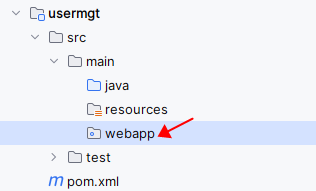
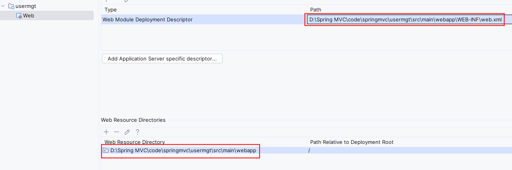


### 配置web.xml文件
```xml
<?xml version="1.0" encoding="UTF-8"?>
<web-app xmlns="https://jakarta.ee/xml/ns/jakartaee"
         xmlns:xsi="http://www.w3.org/2001/XMLSchema-instance"
         xsi:schemaLocation="https://jakarta.ee/xml/ns/jakartaee https://jakarta.ee/xml/ns/jakartaee/web-app_6_0.xsd"
         version="6.0">

    <!--字符编码过滤器-->
    <filter>
        <filter-name>characterEncodingFilter</filter-name>
        <filter-class>org.springframework.web.filter.CharacterEncodingFilter</filter-class>
        <init-param>
            <param-name>encoding</param-name>
            <param-value>UTF-8</param-value>
        </init-param>
        <init-param>
            <param-name>forceRequestEncoding</param-name>
            <param-value>true</param-value>
        </init-param>
        <init-param>
            <param-name>forceResponseEncoding</param-name>
            <param-value>true</param-value>
        </init-param>
    </filter>
    <filter-mapping>
        <filter-name>characterEncodingFilter</filter-name>
        <url-pattern>/*</url-pattern>
    </filter-mapping>
    
    <!--HTTP请求方式过滤器-->
    <filter>
        <filter-name>hiddenHttpMethodFilter</filter-name>
        <filter-class>org.springframework.web.filter.HiddenHttpMethodFilter</filter-class>
    </filter>
    <filter-mapping>
        <filter-name>hiddenHttpMethodFilter</filter-name>
        <url-pattern>/*</url-pattern>
    </filter-mapping>
    
    <!--前端控制器-->
    <servlet>
        <servlet-name>springmvc</servlet-name>
        <servlet-class>org.springframework.web.servlet.DispatcherServlet</servlet-class>
        <init-param>
            <param-name>contextConfigLocation</param-name>
            <param-value>classpath:springmvc.xml</param-value>
        </init-param>
        <load-on-startup>1</load-on-startup>
    </servlet>
    <servlet-mapping>
        <servlet-name>springmvc</servlet-name>
        <url-pattern>/</url-pattern>
    </servlet-mapping>

</web-app>
```
注意两个过滤器Filter的配置顺序：

- 先配置 CharacterEncodingFilter
- 再配置 HiddenHttpMethodFilter


### 配置springmvc.xml文件
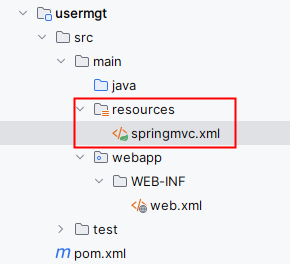
```xml
<?xml version="1.0" encoding="UTF-8"?>
<beans xmlns="http://www.springframework.org/schema/beans"
       xmlns:xsi="http://www.w3.org/2001/XMLSchema-instance" xmlns:mvc="http://www.springframework.org/schema/mvc"
       xmlns:context="http://www.springframework.org/schema/context"
       xsi:schemaLocation="http://www.springframework.org/schema/beans http://www.springframework.org/schema/beans/spring-beans.xsd http://www.springframework.org/schema/mvc https://www.springframework.org/schema/mvc/spring-mvc.xsd http://www.springframework.org/schema/context https://www.springframework.org/schema/context/spring-context.xsd">

    <!--组件扫描-->
    <context:component-scan base-package="com.powernode.usermgt.controller,com.powernode.usermgt.dao"/>

    <!--视图解析器-->
    <bean id="thymeleafViewResolver" class="org.thymeleaf.spring6.view.ThymeleafViewResolver">
        <property name="characterEncoding" value="UTF-8"/>
        <property name="order" value="1"/>
        <property name="templateEngine">
            <bean class="org.thymeleaf.spring6.SpringTemplateEngine">
                <property name="templateResolver">
                    <bean class="org.thymeleaf.spring6.templateresolver.SpringResourceTemplateResolver">
                        <property name="prefix" value="/WEB-INF/thymeleaf/"/>
                        <property name="suffix" value=".html"/>
                        <property name="templateMode" value="HTML"/>
                        <property name="characterEncoding" value="UTF-8"/>
                    </bean>
                </property>
            </bean>
        </property>
    </bean>

    <!--开启注解-->
    <mvc:annotation-driven/>

    <!--开启默认Servlet-->
    <mvc:default-servlet-handler/>

</beans>
```
在WEB-INF目录下新建：thymeleaf目录
创建package：
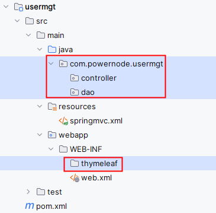


## 显示首页
在应用的根下新建目录：static，将user.css文件拷贝进去。
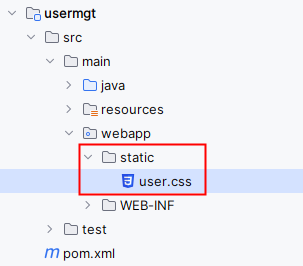
将user_index.html拷贝到WEB-INF/thymeleaf目录下：
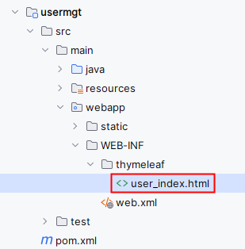
代码有两处需要修改：
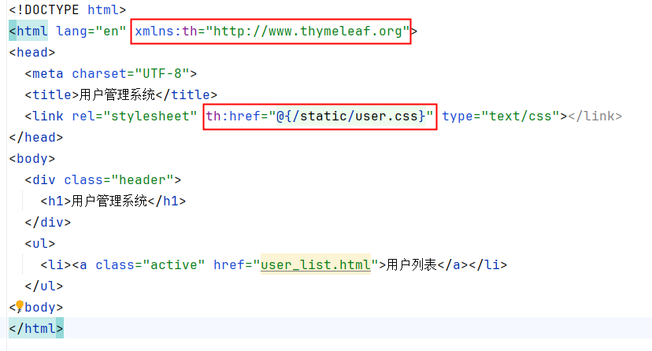


重要：在springmvc.xml文件中配置视图控制器映射：
```xml
<!--视图控制器映射-->
<mvc:view-controller path="/" view-name="user_index"/>
```

部署，启动服务器，测试：
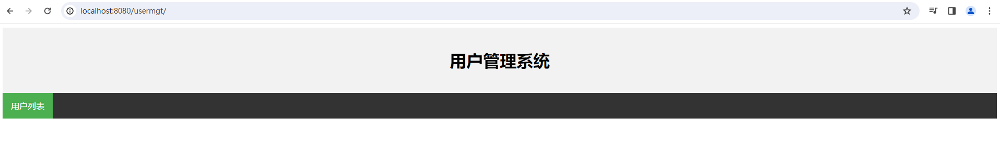


## 实现用户列表
修改user_index.html中的超链接：
```html
<!DOCTYPE html>
<html lang="en" xmlns:th="http://www.thymeleaf.org">
<head>
  <meta charset="UTF-8">
  <title>用户管理系统</title>
  <link rel="stylesheet" th:href="@{/static/user.css}" type="text/css"></link>
</head>
<body>
  <div class="header">
    <h1>用户管理系统</h1>
  </div>
  <ul>
    <li><a class="active" th:href="@{/user}">用户列表</a></li>
  </ul>
</body>
</html>
```
编写bean：User
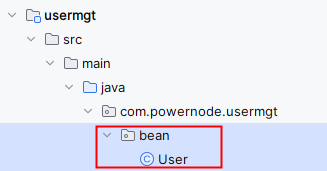


```java
package com.powernode.usermgt.bean;

public class User {
    private Long id;
    private String name;
    private String email;
    private Integer gender;

    public User() {
    }

    public User(Long id, String name, String email, Integer gender) {
        this.id = id;
        this.name = name;
        this.email = email;
        this.gender = gender;
    }

    public Long getId() {
        return id;
    }

    public void setId(Long id) {
        this.id = id;
    }

    public String getName() {
        return name;
    }

    public void setName(String name) {
        this.name = name;
    }

    public String getEmail() {
        return email;
    }

    public void setEmail(String email) {
        this.email = email;
    }

    public Integer getGender() {
        return gender;
    }

    public void setGender(Integer gender) {
        this.gender = gender;
    }

    @Override
    public String toString() {
        return "User{" +
                "id=" + id +
                ", name='" + name + '\'' +
                ", email='" + email + '\'' +
                ", gender=" + gender +
                '}';
    }
}

```


编写UserDao，提供selectAll方法：
```java
package com.powernode.usermgt.dao;

import com.powernode.usermgt.bean.User;
import org.springframework.stereotype.Repository;

import java.util.ArrayList;
import java.util.List;

@Repository
public class UserDao {
    private static List<User> users = new ArrayList<>();
    static {
        User user1 = new User(10001L, "张三", "zhangsan@powernode.com", 1);
        User user2 = new User(10002L, "李四", "lisi@powernode.com", 1);
        User user3 = new User(10003L, "王五", "wangwu@powernode.com", 1);
        User user4 = new User(10004L, "赵六", "zhaoliu@powernode.com", 0);
        User user5 = new User(10005L, "钱七", "qianqi@powernode.com", 0);
        users.add(user1);
        users.add(user2);
        users.add(user3);
        users.add(user4);
        users.add(user5);
    }

    public List<User> selectAll(){
        return users;
    }
}

```
编写控制器UserController：
```java
package com.powernode.usermgt.controller;

import com.powernode.usermgt.bean.User;
import com.powernode.usermgt.dao.UserDao;
import org.springframework.beans.factory.annotation.Autowired;
import org.springframework.stereotype.Controller;
import org.springframework.ui.Model;
import org.springframework.web.bind.annotation.GetMapping;

import java.util.List;

@Controller
public class UserController {

    @Autowired
    private UserDao userDao;

    @GetMapping("/user")
    public String list(Model model){
        // 获取所有的用户
        List<User> users = userDao.selectAll();
        // 存储到request域
        model.addAttribute("users", users);
        // 跳转视图
        return "user_list";
    }
}

```


将user_list.html拷贝到thymeleaf目录下，并进行代码修改，显示用户列表：
```html
<!DOCTYPE html>
<html lang="en" xmlns:th="http://www.thymeleaf.org">
<head>
  <meta charset="UTF-8">
  <title>用户列表</title>
  <link rel="stylesheet" th:href="@{/static/user.css}" type="text/css"></link>
</head>
<body>
  <div class="header">
    <h1>用户列表</h1>
  </div>
  <div class="add-button-wrapper">
    <a class="add-button" href="user_add.html">新增用户</a>
  </div>
  <table>
    <thead>
      <tr>
        <th>编号</th>
        <th>用户名</th>
        <th>性别</th>
        <th>邮箱</th>
        <th>操作</th>
      </tr>
    </thead>
	<tbody>

      <tr th:each="user : ${users}">
        <td th:text="${user.id}"></td>
        <td th:text="${user.name}"></td>
        <td th:text="${user.gender == 1 ? '男' : '女'}"></td>
        <td th:text="${user.email}"></td>
        <td>
          <a href="">修改</a>
          <a href="">删除</a>
        </td>
      </tr>

    </tbody>
  </table>
</body>
</html>
```


测试结果：
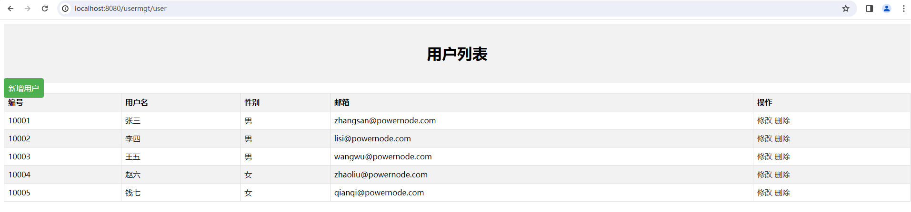


## 实现新增功能
### 跳转到新增页面
在用户列表页面，修改`新增用户`的超链接：
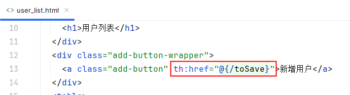
将user_add.html拷贝到thymeleaf目录下，并进行代码修改如下：
```html
<!DOCTYPE html>
<html lang="en" xmlns:th="http:www.thymeleaf.org">
<head>
  <meta charset="UTF-8">
  <title>新增用户</title>
  <link rel="stylesheet" th:href="@{/static/user.css}" type="text/css"></link>
</head>
<body>
  <h1>新增用户</h1>
  <form>
    <label>用户名:</label>
    <input type="text" name="username" required>

    <label>性别:</label>
    <select name="gender" required>
      <option value="">-- 请选择 --</option>
      <option value="1">男</option>
      <option value="0">女</option>
    </select>

    <label>邮箱:</label>
    <input type="email" name="email" required>

	<button type="submit">保存</button>
  </form>
</body>
</html>
```


在springmvc.xml文件中配置`视图控制器映射`：
```xml
<mvc:view-controller path="/toSave" view-name="user_add"/>
```
启动服务器测试：
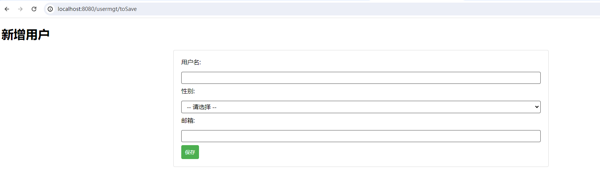


### 实现新增功能
前端页面发送POST请求，提交表单，user_add.html代码如下：
```html
<!DOCTYPE html>
<html lang="en" xmlns:th="http:www.thymeleaf.org">
<head>
  <meta charset="UTF-8">
  <title>新增用户</title>
  <link rel="stylesheet" th:href="@{/static/user.css}" type="text/css"></link>
</head>
<body>
  <h1>新增用户</h1>
  <form th:action="@{/user}" method="post">
    <label>用户名:</label>
    <input type="text" name="name" required>

    <label>性别:</label>
    <select name="gender" required>
      <option value="">-- 请选择 --</option>
      <option value="1">男</option>
      <option value="0">女</option>
    </select>

    <label>邮箱:</label>
    <input type="email" name="email" required>

	<button type="submit">保存</button>
  </form>
</body>
</html>
```
编写控制器UserController：
```java
@PostMapping("/user")
public String save(User user){
    // 保存用户
    userDao.save(user);
    // 重定向到列表
    return "redirect:/user";
}
```
**注意：保存成功后，采用重定向的方式跳转到用户列表。**


编写UserDao：
```java
public static Long generateId(){
    // Stream API
    Long maxId = users.stream().map(user -> user.getId()).reduce((id1, id2) -> id1 > id2 ? id1 : id2).get();
    return maxId + 1;
}

public void save(User user){
    // 设置id
    user.setId(generateId());
    // 保存
    users.add(user);
}
```
**注意：单独写了一个方法生成id，内部使用了Stream API，不会这块内容的可以看老杜最新发布的2024版JavaSE。**


启动服务器测试：
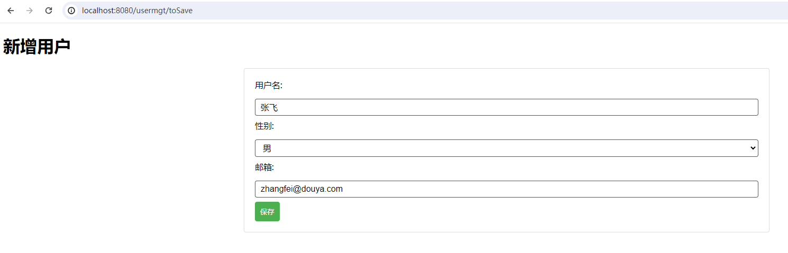
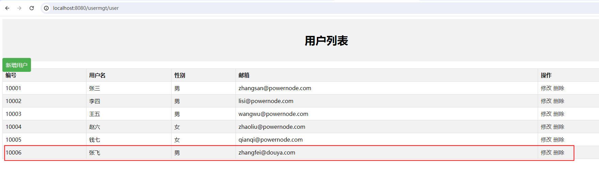


## 跳转到修改页面
修改user_list.html中`修改`超链接：
```html
<a th:href="@{'/user/' + ${user.id}}">修改</a>
```
编写Controller：
```java
@GetMapping("/user/{id}")
public String toUpdate(@PathVariable("id") Long id, Model model){
    // 根据id查询用户信息
    User user = userDao.selectById(id);
    // 将对象存储到request域
    model.addAttribute("user", user);
    // 跳转视图
    return "user_edit";
}
```
编写UserDao：
```java
public User selectById(Long id){
    return users.stream().filter(user -> user.getId().equals(id)).findFirst().get();
}
```
将user_edit.html拷贝thymeleaf目录下，并修改代码如下：
```html
<!DOCTYPE html>
<html lang="en" xmlns:th="http://www.thymeleaf.org">
<head>
  <meta charset="UTF-8">
  <title>修改用户</title>
  <link rel="stylesheet" th:href="@{/static/user.css}" type="text/css"></link>
</head>
<body>
  <h1>修改用户</h1>
  <form>
    <label>用户名:</label>
    <input type="text" name="username" th:value="${user.name}" required>

    <label>性别:</label>
    <select name="gender" required>
      <option value="">-- 请选择 --</option>
      <option value="1" th:field="${user.gender}">男</option>
      <option value="0" th:field="${user.gender}">女</option>
    </select>

    <label>邮箱:</label>
    <input type="email" name="email" th:value="${user.email}" required>

    <button type="submit">修改</button>
  </form>
</body>
</html>
```


启动服务器测试：
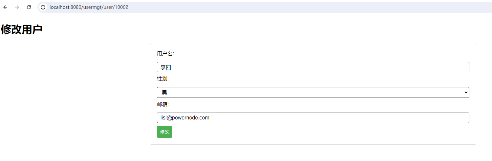


## 实现修改功能
将user_edit.html页面中的form表单修改一下，添加action，添加method，隐藏域的方式提交请求方式put，隐藏域的方式提交id：
```html
<form th:action="@{/user}" method="post">
  <!--隐藏域的方式设置请求方式为put请求-->
  <input type="hidden" name="_method" value="put">
  <!--隐藏域的方式提交id-->
  <input type="hidden" name="id" th:value="${user.id}">

  <label>用户名:</label>
  <input type="text" name="name" th:value="${user.name}" required>

  <label>性别:</label>
  <select name="gender" required>
    <option value="">-- 请选择 --</option>
    <option value="1" th:field="${user.gender}">男</option>
    <option value="0" th:field="${user.gender}">女</option>
  </select>

  <label>邮箱:</label>
  <input type="email" name="email" th:value="${user.email}" required>

  <button type="submit">修改</button>
</form>
```
编写Controller：
```java
@PutMapping("/user")
public String modify(User user){
    // 更新数据
    userDao.update(user);
    // 重定向
    return "redirect:/user";
}
```
编写UserDao：
```java
public void update(User user){
    for (int i = 0; i < users.size(); i++) {
        if(user.getId().equals(users.get(i).getId())){
            users.set(i, user);
            break;
        }
    }
}
```


启动服务器测试：
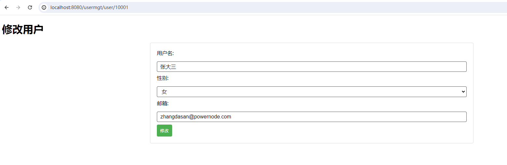
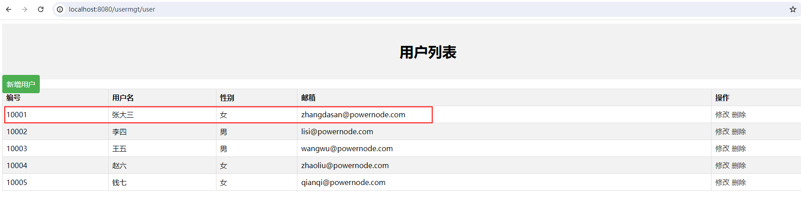


## 实现删除功能
删除应该发送DELETE请求，要模拟DELETE请求，就需要使用表单方式提交。因此我们点击`删除`超链接时需要采用表单方式提交。
在user_list.html页面添加form表单，并且点击超链接时应该提交表单，代码如下：
```html
<!DOCTYPE html>
<html lang="en" xmlns:th="http://www.thymeleaf.org">
<head>
  <meta charset="UTF-8">
  <title>用户列表</title>
  <link rel="stylesheet" th:href="@{/static/user.css}" type="text/css"></link>
</head>
<body>
  <div class="header">
    <h1>用户列表</h1>
  </div>
  <div class="add-button-wrapper">
    <a class="add-button" th:href="@{/toSave}">新增用户</a>
  </div>
  <table>
    <thead>
      <tr>
        <th>编号</th>
        <th>用户名</th>
        <th>性别</th>
        <th>邮箱</th>
        <th>操作</th>
      </tr>
    </thead>
	<tbody>

      <tr th:each="user : ${users}">
        <td th:text="${user.id}"></td>
        <td th:text="${user.name}"></td>
        <td th:text="${user.gender == 1 ? '男' : '女'}"></td>
        <td th:text="${user.email}"></td>
        <td>
          <a th:href="@{'/user/' + ${user.id}}">修改</a>
          <!--为删除提供一个鼠标单击事件-->
          <a th:href="@{'/user/' + ${user.id}}" onclick="del(event)">删除</a>
        </td>
      </tr>

    </tbody>
  </table>

  <!--为删除操作准备一个form表单，点击删除时提交form表单-->
  <div style="display: none">
  <form method="post" id="delForm">
    <input type="hidden" name="_method" value="delete"/>
  </form>
  </div>

  <script>
    function del(event){
      // 获取表单
      let delForm = document.getElementById("delForm");
      // 设置表单action
      delForm.action = event.target.href;
      if(window.confirm("您确定要删除吗？")){
        // 提交表单
        delForm.submit();
      }
      // 阻止超链接默认行为
      event.preventDefault();
    }
  </script>
</body>
</html>
```


编写Controller:
```java
@DeleteMapping("/user/{id}")
public String del(@PathVariable("id") Long id){
    // 删除
    userDao.deleteById(id);
    // 重定向
    return "redirect:/user";
}
```
编写UserDao:
```java
public void deleteById(Long id){
    for (int i = 0; i < users.size(); i++) {
        if(id.equals(users.get(i).getId())){
            users.remove(i);
            break;
        }
    }
}
```
启动服务器测试：
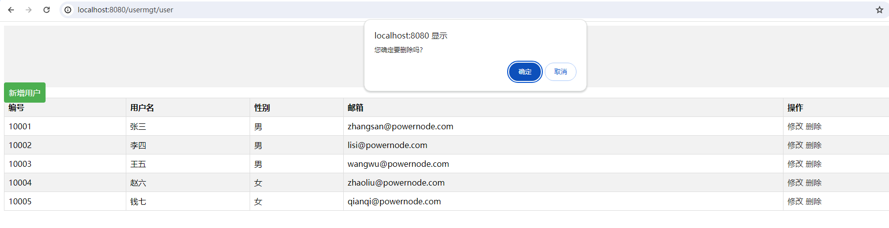
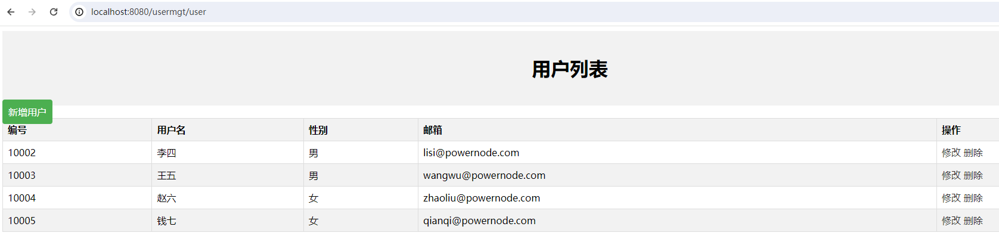


