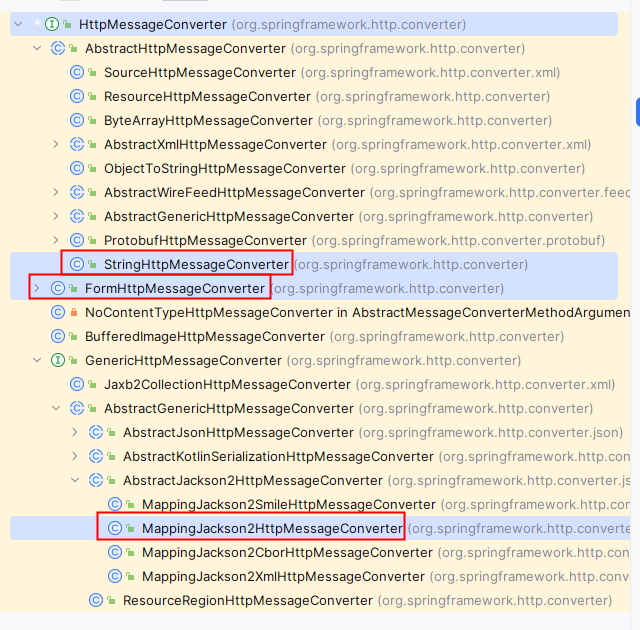
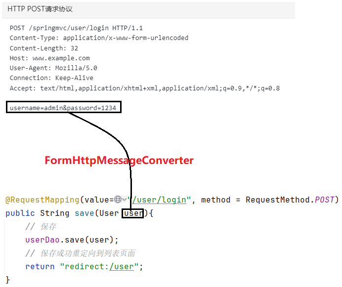
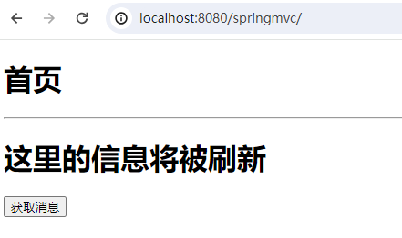
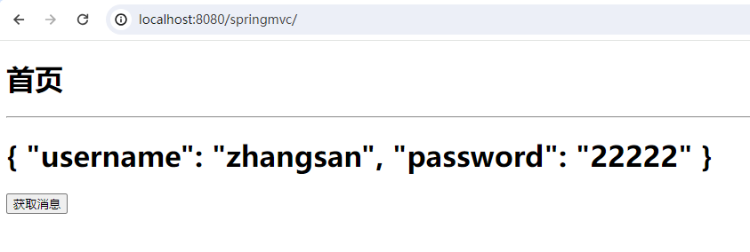
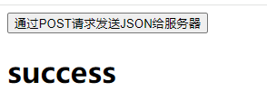
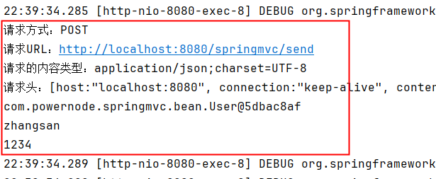
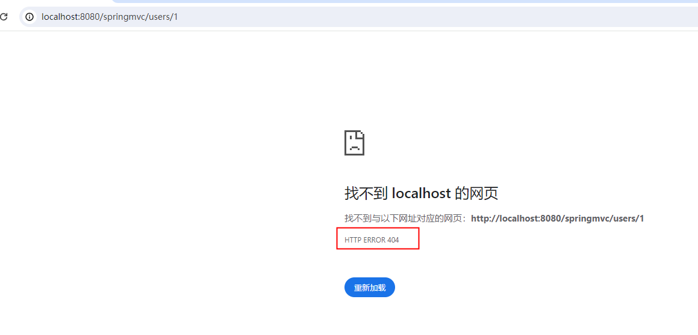

# HttpMessageConverter
HttpMessageConverter是Spring MVC中非常重要的一个接口。翻译为：HTTP消息转换器。该接口下提供了很多实现类，不同的实现类有不同的转换方式。



## 什么是HTTP消息
HTTP消息其实就是HTTP协议。HTTP协议包括请求协议和响应协议。
以下是一份HTTP POST请求协议：
```
POST /springmvc/user/login HTTP/1.1																												--请求行
Content-Type: application/x-www-form-urlencoded																						--请求头
Content-Length: 32
Host: www.example.com
User-Agent: Mozilla/5.0
Connection: Keep-Alive
Accept: text/html,application/xhtml+xml,application/xml;q=0.9,*/*;q=0.8
                                                                                          --空白行
username=admin&password=1234																															--请求体
```
以下是一份HTTP GET请求协议：
```
GET /springmvc/user/del?id=1&name=zhangsan HTTP/1.1																				--请求行
Host: www.example.com																																			--请求头
User-Agent: Mozilla/5.0
Connection: Keep-Alive
Accept: text/html,application/xhtml+xml,application/xml;q=0.9,*/*;q=0.8
```
以下是一份HTTP响应协议：
```
HTTP/1.1 200 OK																																					--状态行
Date: Thu, 01 Jul 2021 06:35:45 GMT																											--响应头
Content-Type: text/plain; charset=utf-8
Content-Length: 12
Connection: keep-alive
Server: Apache/2.4.43 (Win64) OpenSSL/1.1.1g
                                                                                        --空白行
<!DOCTYPE html>																																					--响应体
<html>
  <head>
    <title>hello</title>
  </head>
  <body>
    <h1>Hello World!</h1>
  </body>
</html>
```


## 转换器转换的是什么
转换的是`HTTP协议`与`Java程序中的对象`之间的互相转换。请看下图：

上图是我们之前经常写的代码。请求体中的数据是如何转换成user对象的，底层实际上使用了`HttpMessageConverter`接口的其中一个实现类`FormHttpMessageConverter`。
通过上图可以看出`FormHttpMessageConverter`是负责将`请求协议`转换为`Java对象`的。

再看下图：

上图的代码也是之前我们经常写的，Controller返回值看做逻辑视图名称，视图解析器将其转换成物理视图名称，生成视图对象，`StringHttpMessageConverter`负责将视图对象中的HTML字符串写入到HTTP协议的响应体中。最终完成响应。
通过上图可以看出`StringHttpMessageConverter`是负责将`Java对象`转换为`响应协议`的。


通过以上内容的学习，大家应该能够了解到`HttpMessageConverter`接口是用来做什么的了：

如上图所示：HttpMessageConverter接口的可以将请求协议转换成Java对象，也可以把Java对象转换为响应协议。
**HttpMessageConverter是接口，SpringMVC帮我们提供了非常多而丰富的实现类。每个实现类都有自己不同的转换风格。**
**对于我们程序员来说，Spring MVC已经帮助我们写好了，我们只需要在不同的业务场景下，选择合适的HTTP消息转换器即可。**
**怎么选择呢？当然是通过SpringMVC为我们提供的注解，我们通过使用不同的注解来启用不同的消息转换器。**

在HTTP消息转换器这一小节，我们重点要掌握的是两个注解两个类：

- @ResponseBody
- @RequestBody
- ResponseEntity
- RequestEntity


# Spring MVC中的AJAX请求
SpringMVC+Vue3+Thymeleaf+Axios发送一个简单的AJAX请求。

引入Vue和Axios的js文件：


```xml
<?xml version="1.0" encoding="UTF-8"?>
<beans xmlns="http://www.springframework.org/schema/beans"
       xmlns:xsi="http://www.w3.org/2001/XMLSchema-instance"
       xmlns:context="http://www.springframework.org/schema/context"
       xmlns:mvc="http://www.springframework.org/schema/mvc"
       xsi:schemaLocation="http://www.springframework.org/schema/beans http://www.springframework.org/schema/beans/spring-beans.xsd http://www.springframework.org/schema/context https://www.springframework.org/schema/context/spring-context.xsd http://www.springframework.org/schema/mvc https://www.springframework.org/schema/mvc/spring-mvc.xsd">

    <!--组件扫描-->
    <context:component-scan base-package="com.powernode.springmvc.controller"/>

    <!--视图解析器-->
    <bean id="thymeleafViewResolver" class="org.thymeleaf.spring6.view.ThymeleafViewResolver">
        <property name="characterEncoding" value="UTF-8"/>
        <property name="order" value="1"/>
        <property name="templateEngine">
            <bean class="org.thymeleaf.spring6.SpringTemplateEngine">
                <property name="templateResolver">
                    <bean class="org.thymeleaf.spring6.templateresolver.SpringResourceTemplateResolver">
                        <property name="prefix" value="/WEB-INF/thymeleaf/"/>
                        <property name="suffix" value=".html"/>
                        <property name="templateMode" value="HTML"/>
                        <property name="characterEncoding" value="UTF-8"/>
                    </bean>
                </property>
            </bean>
        </property>
    </bean>

    <!--视图控制器映射-->
    <mvc:view-controller path="/" view-name="index"/>

    <!--开启注解驱动-->
    <mvc:annotation-driven/>

    <!--静态资源处理-->
    <mvc:default-servlet-handler/>

</beans>
```
重点是静态资源处理、开启注解驱动、视图控制器映射等相关配置。


Vue3+Thymeleaf+Axios发送AJAX请求:
```html
<!DOCTYPE html>
<html lang="en" xmlns:th="http://www.thymeleaf.org">
<head>
    <meta charset="UTF-8">
    <title>首页</title>
    <script th:src="@{/static/js/vue3.4.21.js}"></script>
    <script th:src="@{/static/js/axios.min.js}"></script>
</head>
<body>
<h1>首页</h1>
<hr>

<div id="app">
    <h1>{{message}}</h1>
    <button @click="getMessage">获取消息</button>
</div>

<script th:inline="javascript">
    Vue.createApp({
        data(){
            return {
                message : "这里的信息将被刷新"
            }
        },
        methods:{
            async getMessage(){
                try {
                    const response = await axios.get([[@{/}]] + 'hello')
                    this.message = response.data
                }catch (e) {
                    console.error(e)
                }
            }
        }
    }).mount("#app")
</script>

</body>
</html>
```


**重点来了，Controller怎么写呢，之前我们都是传统的请求，Controller返回一个**`**逻辑视图名**`**，然后交给**`**视图解析器**`**解析。最后跳转页面。而AJAX请求是不需要跳转页面的，因为AJAX是页面局部刷新，以前我们在Servlet中使用**`**response.getWriter().print("message")**`**的方式响应。在Spring MVC中怎么办呢？当然，我们在Spring MVC中也可以使用Servlet原生API来完成这个功能，代码如下：**
```java
package com.powernode.springmvc.controller;

import jakarta.servlet.http.HttpServletResponse;
import org.springframework.stereotype.Controller;
import org.springframework.web.bind.annotation.RequestMapping;

import java.io.IOException;

@Controller
public class HelloController {

    @RequestMapping(value = "/hello")
    public String hello(HttpServletResponse response) throws IOException {
        response.getWriter().print("hello");
        return null;
    }
}

```
或者这样也行：不需要有返回值
```java
package com.powernode.springmvc.controller;

import jakarta.servlet.http.HttpServletResponse;
import org.springframework.stereotype.Controller;
import org.springframework.web.bind.annotation.RequestMapping;

import java.io.IOException;

@Controller
public class HelloController {

    @RequestMapping(value = "/hello")
    public void hello(HttpServletResponse response) throws IOException {
        response.getWriter().print("hello");
    }
}

```


启动服务器测试：[http://localhost:8080/springmvc/](http://localhost:8080/springmvc/)


**注意：如果采用这种方式响应，则和 springmvc.xml 文件中配置的视图解析器没有关系，不走视图解析器了。**


难道我们以后AJAX请求都要使用原生Servlet API吗？

- 不需要，我们可以使用SpringMVC中提供的HttpMessageConverter消息转换器。

我们要向前端响应一个字符串"hello"，这个"hello"就是响应协议中的响应体。
我们可以使用 @ResponseBody 注解来启用对应的消息转换器。而这种消息转换器只负责将Controller返回的信息以响应体的形式写入响应协议。


# @ResponseBody
## StringHttpMessageConverter
上面的AJAX案例，Controller的代码可以修改为：
```java
package com.powernode.springmvc.controller;

import org.springframework.stereotype.Controller;
import org.springframework.web.bind.annotation.RequestMapping;
import org.springframework.web.bind.annotation.ResponseBody;

@Controller
public class HelloController {

    @RequestMapping(value = "/hello")
    @ResponseBody
    public String hello(){
        // 由于你使用了 @ResponseBody 注解
        // 以下的return语句返回的字符串则不再是“逻辑视图名”了
        // 而是作为响应协议的响应体进行响应。
        return "hello";
    }
}
```
最核心需要理解的位置是：return "hello";
这里的"hello"不是逻辑视图名了，而是作为响应体的内容进行响应。直接输出到浏览器客户端。
以上程序中使用的消息转换器是：**StringHttpMessageConverter**，为什么会启用这个消息转换器呢？因为你添加`@ResponseBody`这个注解。

通常AJAX请求需要服务器给返回一段JSON格式的字符串，可以返回JSON格式的字符串吗？当然可以，代码如下：
```java
package com.powernode.springmvc.controller;

import org.springframework.stereotype.Controller;
import org.springframework.web.bind.annotation.RequestMapping;
import org.springframework.web.bind.annotation.ResponseBody;

@Controller
public class HelloController {

    @RequestMapping(value = "/hello")
    @ResponseBody
    public String hello(){
        return "{\"username\":\"zhangsan\",\"password\":\"1234\"}";
    }
}
```


测试：

这是完全可以的，此时底层使用的消息转换器还是：**StringHttpMessageConverter**

那如果在程序中是一个POJO对象，怎么将POJO对象以JSON格式的字符串响应给浏览器呢？两种方式：

- 第一种方式：自己写代码将POJO对象转换成JSON格式的字符串，用上面的方式直接return即可。
- 第二种方式：启用`MappingJackson2HttpMessageConverter`消息转换器。


## MappingJackson2HttpMessageConverter
启用MappingJackson2HttpMessageConverter消息转换器的步骤如下：

第一步：引入jackson依赖，可以将java对象转换为json格式字符串
```xml
<dependency>
  <groupId>com.fasterxml.jackson.core</groupId>
  <artifactId>jackson-databind</artifactId>
  <version>2.17.0</version>
</dependency>
```

第二步：开启注解驱动
这一步非常关键，开启注解驱动后，在HandlerAdapter中会自动装配一个消息转换器：MappingJackson2HttpMessageConverter
```xml
<mvc:annotation-driven/>
```


第三步：准备一个POJO
```java
package com.powernode.springmvc.bean;

public class User {
    private String username;
    private String password;

    public User() {
    }

    public User(String username, String password) {
        this.username = username;
        this.password = password;
    }

    public String getUsername() {
        return username;
    }

    public void setUsername(String username) {
        this.username = username;
    }

    public String getPassword() {
        return password;
    }

    public void setPassword(String password) {
        this.password = password;
    }
}
```


第四步：控制器方法使用 @ResponseBody 注解标注(非常重要），控制器方法返回这个POJO对象
```java
package com.powernode.springmvc.controller;

import com.powernode.springmvc.bean.User;
import org.springframework.stereotype.Controller;
import org.springframework.web.bind.annotation.RequestMapping;
import org.springframework.web.bind.annotation.ResponseBody;

@Controller
public class HelloController {

    @RequestMapping(value = "/hello")
    @ResponseBody
    public User hello(){
        User user = new User("zhangsan", "22222");
        return user;
    }
}

```


测试：


以上代码底层启用的就是 MappingJackson2HttpMessageConverter 消息转换器。
他的功能很强大，可以将POJO对象转换成JSON格式的字符串，响应给前端。
其实这个消息转换器`MappingJackson2HttpMessageConverter`本质上只是比`StringHttpMessageConverter`多了一个json字符串的转换，其他的还是一样。


# @RestController
因为我们现代的开发方式都是基于AJAX方式的，因此 @ResponseBody 注解非常重要，很常用。
为了方便，Spring MVC中提供了一个注解 @RestController。这一个注解代表了：@Controller + @ResponseBody。
@RestController 标注在类上即可。被它标注的Controller中所有的方法上都会自动标注 @ResponseBody

```java
package com.powernode.springmvc.controller;

import com.powernode.springmvc.bean.User;
import org.springframework.web.bind.annotation.RequestMapping;
import org.springframework.web.bind.annotation.RestController;

@RestController
public class HelloController {

    @RequestMapping(value = "/hello")
    public User hello(){
        User user = new User("zhangsan", "22222");
        return user;
    }
}

```


测试：


# @RequestBody
## FormHttpMessageConverter
这个注解的作用是直接将请求体传递给Java程序，在Java程序中可以直接使用一个String类型的变量接收这个请求体的内容。

在没有使用这个注解的时候：
```java
@RequestMapping("/save")
public String save(User user){
    // 执行保存的业务逻辑
    userDao.save(user);
    // 保存成功跳转到成功页面
    return "success";
}
```
当请求体提交的数据是：
```
username=zhangsan&password=1234&email=zhangsan@powernode.com
```
那么Spring MVC会自动使用 `FormHttpMessageConverter`消息转换器，将请求体转换成user对象。


当使用这个注解的时候：**这个注解只能出现在方法的参数上。**
```java
@RequestMapping("/save")
public String save(@RequestBody String requestBodyStr){
    System.out.println("请求体：" + requestBodyStr);
    return "success";
}
```
Spring MVC仍然会使用 `FormHttpMessageConverter`消息转换器，将请求体直接以字符串形式传递给 requestBodyStr 变量。
测试输出结果：


## MappingJackson2HttpMessageConverter
另外，如果在请求体中提交的是一个JSON格式的字符串，这个JSON字符串传递给Spring MVC之后，能不能将JSON字符串转换成POJO对象呢？答案是可以的。
此时必须使用@RequestBody 注解来完成 。并且底层使用的消息转换器是：`MappingJackson2HttpMessageConverter`。实现步骤如下：

- 第一步：引入jackson依赖
- 第二步：开启注解驱动
- 第三步：创建POJO类，将POJO类作为控制器方法的参数，并使用 @RequestBody 注解标注该参数
```java
@RequestMapping("/send")
@ResponseBody
public String send(@RequestBody User user){
    System.out.println(user);
    System.out.println(user.getUsername());
    System.out.println(user.getPassword());
    return "success";
}
```

- 第四步：在请求体中提交json格式的数据
```html
<!DOCTYPE html>
<html lang="en" xmlns:th="http://www.thymeleaf.org">
<head>
    <meta charset="UTF-8">
    <title>首页</title>
    <script th:src="@{/static/js/vue3.4.21.js}"></script>
    <script th:src="@{/static/js/axios.min.js}"></script>
</head>
<body>

<div id="app">
    <button @click="sendJSON">通过POST请求发送JSON给服务器</button>
    <h1>{{message}}</h1>
</div>

<script>
    let jsonObj = {"username":"zhangsan", "password":"1234"}

    Vue.createApp({
        data(){
            return {
                message:""
            }
        },
        methods: {
            async sendJSON(){
                console.log("sendjson")
                try{
                    const res = await axios.post('/springmvc/send', JSON.stringify(jsonObj), {
                        headers : {
                            "Content-Type" : "application/json"
                        }
                    })
                    this.message = res.data
                }catch(e){
                    console.error(e)
                }
            }
        }
    }).mount("#app")
</script>

</body>
</html>
```


测试结果：



# RequestEntity
RequestEntity不是一个注解，是一个普通的类。这个类的实例封装了整个请求协议：包括请求行、请求头、请求体所有信息。
出现在控制器方法的参数上：
```html
<!DOCTYPE html>
<html lang="en" xmlns:th="http://www.thymeleaf.org">
<head>
    <meta charset="UTF-8">
    <title>首页</title>
    <script th:src="@{/static/js/vue3.4.21.js}"></script>
    <script th:src="@{/static/js/axios.min.js}"></script>
</head>
<body>

<div id="app">
    <button @click="sendJSON">通过POST请求发送JSON给服务器</button>
    <h1>{{message}}</h1>
</div>

<script>
    let jsonObj = {"username":"zhangsan", "password":"1234"}

    Vue.createApp({
        data(){
            return {
                message:""
            }
        },
        methods: {
            async sendJSON(){
                console.log("sendjson")
                try{
                    const res = await axios.post('/springmvc/send', JSON.stringify(jsonObj), {
                        headers : {
                            "Content-Type" : "application/json"
                        }
                    })
                    this.message = res.data
                }catch(e){
                    console.error(e)
                }
            }
        }
    }).mount("#app")
</script>

</body>
</html>
```
```java
@RequestMapping("/send")
@ResponseBody
public String send(RequestEntity<User> requestEntity){
    System.out.println("请求方式：" + requestEntity.getMethod());
    System.out.println("请求URL：" + requestEntity.getUrl());
    HttpHeaders headers = requestEntity.getHeaders();
    System.out.println("请求的内容类型：" + headers.getContentType());
    System.out.println("请求头：" + headers);

    User user = requestEntity.getBody();
    System.out.println(user);
    System.out.println(user.getUsername());
    System.out.println(user.getPassword());
    return "success";
}
```
测试结果：

在实际的开发中，如果你需要获取更详细的请求协议中的信息。可以使用`RequestEntity`


# ResponseEntity
ResponseEntity不是注解，是一个类。用该类的实例可以封装响应协议，包括：状态行、响应头、响应体。也就是说：如果你想定制属于自己的响应协议，可以使用该类。
假如我要完成这样一个需求：前端提交一个id，后端根据id进行查询，如果返回null，请在前端显示404错误。如果返回不是null，则输出返回的user。
```java
@Controller
public class UserController {
     
    @GetMapping("/users/{id}")
    public ResponseEntity<User> getUserById(@PathVariable Long id) {
        User user = userService.getUserById(id);
        if (user == null) {
            return ResponseEntity.status(HttpStatus.NOT_FOUND).body(null);
        } else {
            return ResponseEntity.ok(user);
        }
    }
}
```


测试：当用户不存在时


测试：当用户存在时

