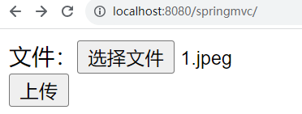
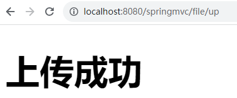
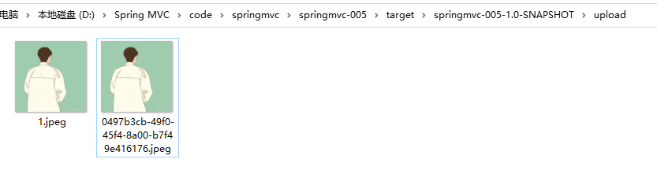
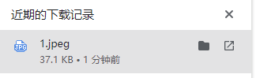

# 文件上传
使用SpringMVC6版本，**不需要**添加以下依赖：
```xml
<dependency>
    <groupId>commons-fileupload</groupId>
    <artifactId>commons-fileupload</artifactId>
    <version>1.5</version>
</dependency>
```
前端页面：
```html
<!DOCTYPE html>
<html lang="en" xmlns:th="http://www.thymeleaf.org">
<head>
    <meta charset="UTF-8">
    <title>文件上传</title>
</head>
<body>

<!--文件上传表单-->
<form th:action="@{/file/up}" method="post" enctype="multipart/form-data">
    文件：<input type="file" name="fileName"/><br>
    <input type="submit" value="上传">
</form>

</body>
</html>
```
重点是：form表单采用post请求，enctype是multipart/form-data，并且上传组件是：type="file"


web.xml文件：
```xml
<!--前端控制器-->
<servlet>
    <servlet-name>dispatcherServlet</servlet-name>
    <servlet-class>org.springframework.web.servlet.DispatcherServlet</servlet-class>
    <init-param>
        <param-name>contextConfigLocation</param-name>
        <param-value>classpath:springmvc.xml</param-value>
    </init-param>
    <load-on-startup>1</load-on-startup>
    <multipart-config>
        <!--设置单个支持最大文件的大小-->
        <max-file-size>102400</max-file-size>
        <!--设置整个表单所有文件上传的最大值-->
        <max-request-size>102400</max-request-size>
        <!--设置最小上传文件大小-->
        <file-size-threshold>0</file-size-threshold>
    </multipart-config>
</servlet>
<servlet-mapping>
    <servlet-name>dispatcherServlet</servlet-name>
    <url-pattern>/</url-pattern>
</servlet-mapping>
```
**重点：在DispatcherServlet配置时，添加 multipart-config 配置信息。（这是Spring6，如果是Spring5，则不是这样配置，而是在springmvc.xml文件中配置：CommonsMultipartResolver）**
**SpringMVC6中把这个类已经删除了。废弃了。**


Controller中的代码：
```java
package com.powernode.springmvc.controller;

import jakarta.servlet.http.HttpServletRequest;
import org.springframework.stereotype.Controller;
import org.springframework.web.bind.annotation.RequestMapping;
import org.springframework.web.bind.annotation.RequestMethod;
import org.springframework.web.bind.annotation.RequestParam;
import org.springframework.web.multipart.MultipartFile;

import java.io.*;
import java.util.UUID;

@Controller
public class FileController {

    @RequestMapping(value = "/file/up", method = RequestMethod.POST)
    public String fileUp(@RequestParam("fileName") MultipartFile multipartFile, HttpServletRequest request) throws IOException {
        String name = multipartFile.getName();
        System.out.println(name);
        // 获取文件名
        String originalFilename = multipartFile.getOriginalFilename();
        System.out.println(originalFilename);
        // 将文件存储到服务器中
        // 获取输入流
        InputStream in = multipartFile.getInputStream();
        // 获取上传之后的存放目录
        File file = new File(request.getServletContext().getRealPath("/upload"));
        // 如果服务器目录不存在则新建
        if(!file.exists()){
            file.mkdirs();
        }
        // 开始写
        //BufferedOutputStream out = new BufferedOutputStream(new FileOutputStream(file.getAbsolutePath() + "/" + originalFilename));
        // 可以采用UUID来生成文件名，防止服务器上传文件时产生覆盖
        BufferedOutputStream out = new BufferedOutputStream(new FileOutputStream(file.getAbsolutePath() + "/" + UUID.randomUUID().toString() + originalFilename.substring(originalFilename.lastIndexOf("."))));
        byte[] bytes = new byte[1024 * 100];
        int readCount = 0;
        while((readCount = in.read(bytes)) != -1){
            out.write(bytes,0,readCount);
        }
        // 刷新缓冲流
        out.flush();
        // 关闭流
        in.close();
        out.close();

        return "ok";
    }

}

```


最终测试结果：




**建议：上传文件时，文件起名采用UUID。以防文件覆盖。**


# 文件下载
```html
<!--文件下载-->
<a th:href="@{/download}">文件下载</a>
```

文件下载核心程序，使用ResponseEntity：
```java
@GetMapping("/download")
public ResponseEntity<byte[]> downloadFile(HttpServletResponse response, HttpServletRequest request) throws IOException {
    File file = new File(request.getServletContext().getRealPath("/upload") + "/1.jpeg");
    // 创建响应头对象
    HttpHeaders headers = new HttpHeaders();
    // 设置响应内容类型
    headers.setContentType(MediaType.APPLICATION_OCTET_STREAM);
    // 设置下载文件的名称
    headers.setContentDispositionFormData("attachment", file.getName());

    // 下载文件
    ResponseEntity<byte[]> entity = new ResponseEntity<byte[]>(Files.readAllBytes(file.toPath()), headers, HttpStatus.OK);
    return entity;
}
```


效果：



