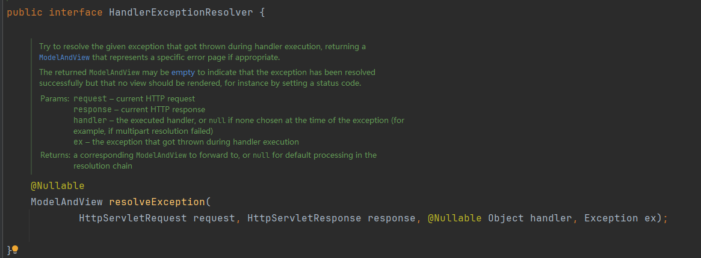
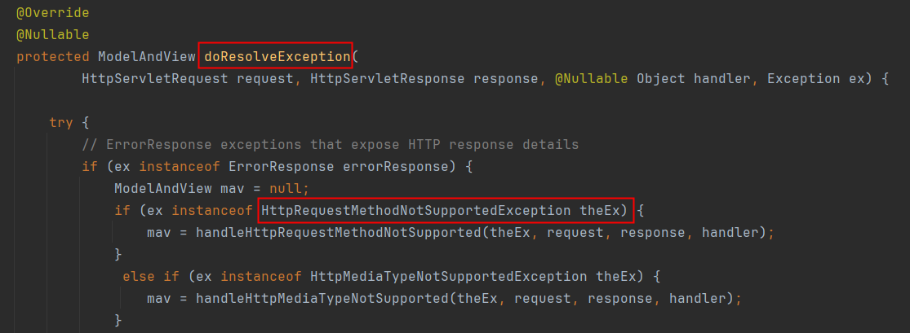
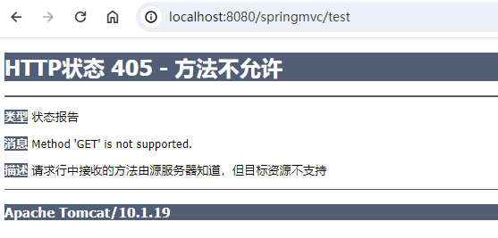

# 什么是异常处理器
Spring MVC在`处理器方法`执行过程中出现了异常，可以采用`异常处理器`进行应对。
一句话概括异常处理器作用：处理器方法执行过程中出现了异常，跳转到对应的视图，在视图上展示友好信息。

SpringMVC为异常处理提供了一个接口：HandlerExceptionResolver

核心方法是：resolveException。
该方法用来编写具体的异常处理方案。返回值ModelAndView，表示异常处理完之后跳转到哪个视图。

HandlerExceptionResolver 接口有两个常用的默认实现：

- DefaultHandlerExceptionResolver
- SimpleMappingExceptionResolver


# 默认的异常处理器
DefaultHandlerExceptionResolver 是默认的异常处理器。
核心方法：

当请求方式和处理方式不同时，DefaultHandlerExceptionResolver的默认处理态度是：



# 自定义的异常处理器
自定义异常处理器需要使用：SimpleMappingExceptionResolver
自定义异常处理机制有两种语法：

- 通过XML配置文件
- 通过注解
## 配置文件方式
```xml
<bean class="org.springframework.web.servlet.handler.SimpleMappingExceptionResolver">
    <property name="exceptionMappings">
        <props>
            <!--用来指定出现异常后，跳转的视图-->
            <prop key="java.lang.Exception">tip</prop>
        </props>
    </property>
    <!--将异常信息存储到request域，value属性用来指定存储时的key。-->
    <property name="exceptionAttribute" value="e"/>
</bean>
```
在视图页面上展示异常信息：
```html
<!DOCTYPE html>
<html lang="en" xmlns:th="http://www.thymeleaf.org">
<head>
    <meta charset="UTF-8">
    <title>出错了</title>
</head>
<body>
<h1>出错了，请联系管理员！</h1>
<div th:text="${e}"></div>
</body>
</html>
```


## 注解方式
```java
@ControllerAdvice
public class ExceptionController {

    @ExceptionHandler
    public String tip(Exception e, Model model){
        model.addAttribute("e", e);
        return "tip";
    }
}
```


